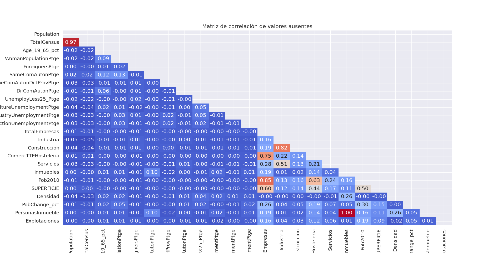
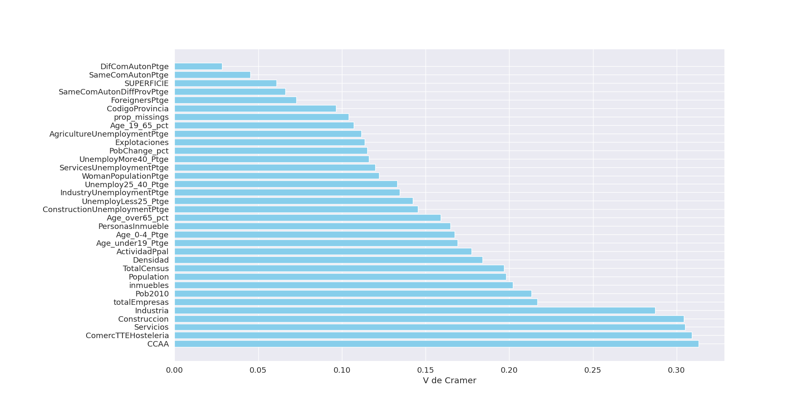
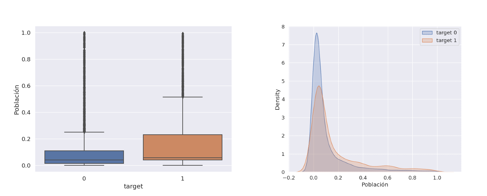
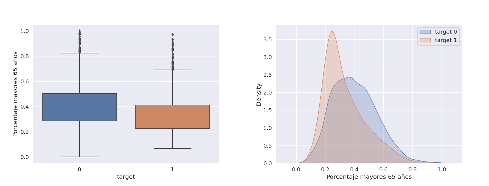
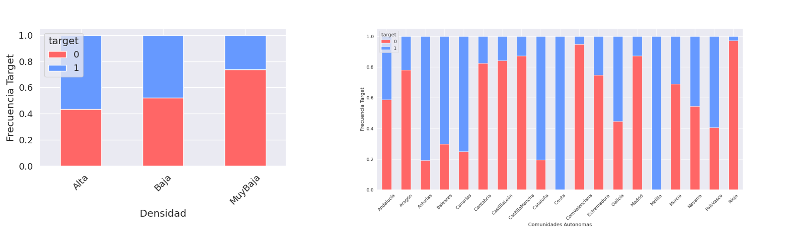

# Proyecto de Minería de Datos

## Portada
- **Nombre del Analista:** Alejandro Borrego Megías
- **Fecha:** 24-12-2023
- **Correo Electrónico:** alejbormeg@gmail.com

## Índice
- [1. Introducción al objetivo del problema y las variables implicadas.](#1-introducción-al-objetivo-del-problema-y-las-variables-implicadas)
- [2. Importación del conjunto de datos y asignación correcta de los tipos de variables.](#2-importación-del-conjunto-de-datos-y-asignación-correcta-de-los-tipos-de-variables)
- [3. Análisis descriptivo del conjunto de datos.](#3-análisis-descriptivo-del-conjunto-de-datos)
  - [3.1 Número de observaciones](#31-número-de-observaciones)
  - [3.2 Número y naturaleza de variables](#32-número-y-naturaleza-de-variables)
  - [3.3 Datos erróneos, etc.](#33-datos-erróneos-etc)
- [4. Corrección de los errores detectados.](#4-corrección-de-los-errores-detectados)
- [5. Análisis de valores atípicos.](#5-análisis-de-valores-atípicos)
  - [5.1 Decisiones tomadas.](#51-decisiones-tomadas)
- [6. Análisis de valores perdidos.](#6-análisis-de-valores-perdidos)
  - [6.1 Estrategias de imputación.](#61-estrategias-de-imputación)
- [7. Transformaciones de variables y relaciones con las variables objetivo.](#7-transformaciones-de-variables-y-relaciones-con-las-variables-objetivo)
- [8. Detección de las relaciones entre las variables input y objetivo.](#8-detección-de-las-relaciones-entre-las-variables-input-y-objetivo)
- [9. Construcción del modelo de regresión lineal.](#9-construcción-del-modelo-de-regresión-lineal)
  - [9.1 Selección de variables clásica](#91-selección-de-variables-clásica)
  - [9.2 Selección de variables aleatoria](#92-selección-de-variables-aleatoria)
  - [9.3 Selección del modelo ganador](#93-selección-del-modelo-ganador)
  - [9.4 Interpretación de los coeficientes de dos variables incluidas en el modelo (una binaria y otra continua)](#94-interpretación-de-los-coeficientes-de-dos-variables-incluidas-en-el-modelo-una-binaria-y-otra-continua)
  - [9.5 Justificación del mejor modelo y medición de la calidad del mismo](#95-justificación-del-mejor-modelo-y-medición-de-la-calidad-del-mismo)
- [10. Construcción del modelo de regresión logística.](#10-construcción-del-modelo-de-regresión-logística)
  - [10.1 Selección de variables clásica](#101-selección-de-variables-clásica)
  - [10.2 Selección de variables aleatoria](#102-selección-de-variables-aleatoria)
  - [10.3 Selección del modelo ganador](#103-selección-del-modelo-ganador)
  - [10.4 Determinación del punto de corte óptimo](#104-determinación-del-punto-de-corte-óptimo)
  - [10.5 Interpretación de los coeficientes de dos variables incluidas en el modelo (una binaria y otra continua)](#105-interpretación-de-los-coeficientes-de-dos-variables-incluidas-en-el-modelo-una-binaria-y-otra-continua)
  - [10.6 Justificación del mejor modelo y medición de la calidad del mismo](#106-justificación-del-mejor-modelo-y-medición-de-la-calidad-del-mismo)


## 1. Introducción al objetivo del problema y las variables implicadas.

En el marco de la investigación y análisis demográfico y político, se aborda el desafío de comprender y prever los patrones de abstención en las elecciones municipales en España. La abstención electoral, medida a través del porcentaje de abstención, es una variable crucial que refleja la participación ciudadana en el proceso democrático.

El conjunto de datos utilizado, denominado "DatosEleccionesEspaña.xlsx", contiene información demográfica detallada sobre los municipios de España, así como los resultados de las últimas elecciones. Este conjunto incluye variables que abarcan desde características poblacionales hasta resultados de votación, proporcionando una visión integral de los factores que podrían influir en la abstención.

El objetivo principal de este análisis es desarrollar dos modelos predictivos: uno de regresión lineal para predecir el porcentaje de abstención y otro de regresión logística para prever la probabilidad de una alta abstención. Estos modelos tienen el propósito de identificar patrones y relaciones significativas entre las diversas variables demográficas y los resultados electorales, lo que podría ayudar a comprender mejor los factores que afectan la participación electoral.

Las variables consideradas serán las siguientes: 

| Variable                        | Descripción                                                                                                  |
|---------------------------------|--------------------------------------------------------------------------------------------------------------|
| Name                            | Nombre del municipio                                                                                        |
| CodigoProvincia                 | Código de la provincia (coincide con los dos primeros dígitos del código postal). Toma 52 valores distintos |
| CCAA                            | Comunidad autónoma a la que pertenece el municipio                                                           |
| Population                      | Población del municipio en 2016                                                                            |
| TotalCensus                     | Población en edad de votar en 2016                                                                         |
| AbstencionAlta                  | Variable dicotómica que toma el valor 1 si el porcentaje de abstención es superior al 30%, y 0 en otro caso   |
| AbstentionPtge                  | Porcentaje de abstención                                                                                  |
| Age_0-4_Ptge                    | Porcentaje de ciudadanos con menos de 5 años                                                               |
| Age_under19_Ptge                | Porcentaje de ciudadanos con menos de 19 años                                                              |
| Age_19_65_pct                   | Porcentaje de ciudadanos entre 19 y 65 años                                                                |
| Age_over65_pct                  | Porcentaje de ciudadanos con más de 65 años                                                               |
| WomanPopulationPtge             | Porcentaje de mujeres                                                                                     |
| ForeignersPtge                  | Porcentaje de extranjeros                                                                                 |
| SameComAutonPtge                | Porcentaje de ciudadanos que reside en la misma provincia en la que nacieron                              |
| SameComAutonDiffProvPtge         | Porcentaje de ciudadanos que reside en la misma CCAA en la que nacieron, pero distinta provincia            |
| DifComAutonPtge                 | Porcentaje de ciudadanos que reside en la distinta CCAA de la que nacieron                                 |
| UnemployLess25_Ptge             | Porcentaje de parados de menos de 25 años                                                                  |
| Unemploy25_40_Ptge              | Porcentaje de parados entre 25 y 40 años                                                                   |
| UnemployMore40_Ptge             | Porcentaje de parados de más de 40 años                                                                    |
| AgricultureUnemploymentPtge     | Porcentaje de parados en el sector de la agricultura                                                        |
| IndustryUnemploymentPtge         | Porcentaje de parados en el sector de la industria                                                          |
| ConstructionUnemploymentPtge     | Porcentaje de parados en el sector de la construcción                                                       |
| ServicesUnemploymentPtge         | Porcentaje de parados en el sector servicios                                                               |
| totalEmpresas                   | Número total de empresas en el municipio                                                                   |
| Industria                        | Número de empresas del sector industrial en el municipio                                                    |
| Construccion                     | Número de empresas del sector de la construcción en el municipio                                           |
| ComercTTEHosteleria              | Número de empresas dedicadas a comercio, transporte u hostelería en el municipio                            |
| Servicios                        | Número de empresas del sector servicios en el municipio                                                      |
| ActividadPpal                    | Actividad principal de las actividades del municipio (Industria, Construcción, ComercTTEHosteleria, Servicios y Otros) |
| inmuebles                        | Número de inmuebles en el municipio                                                                        |
| Pob2010                         | Población en el municipio en 2010                                                                          |
| SUPERFICIE                       | Superficie del municipio                                                                                   |
| densidad                         | Densidad de población del municipio: MuyBaja (<1 hab/ha), Baja (entre 1 y 5 hab/ha), Alta (>5 hab/ha)        |
| PobChange_pct                   | Porcentaje de cambio en la población (valores negativos indican que ha disminuido). Respecto a las anteriores elecciones |
| PersonasInmueble                 | Número medio de personas que habita un inmueble                                                            |
| Explotaciones                    | Número de explotaciones agrícolas en el municipio                                                           |


En última instancia, este estudio busca proporcionar información valiosa para entender los determinantes de la participación electoral en los municipios españoles, contribuyendo así a la toma de decisiones informada en el ámbito político y social.


## 2. Importación del conjunto de datos y asignación correcta de los tipos de variables.

La base de datos se guarda en la carpeta `src/data` y se realiza la importación del conjunto de datos con la librería `Pandas` de Python. Una vez hecho esto eliminamos las variables objetivo relacionadas con el porcentaje de Izquierda, Derecha y otros, tanto continuas como categóricas:

```python
# Cargo los datos
datos = pd.read_excel('src/data/DatosEleccionesEspana.xlsx')

# Eliminamos las variables que no usaremos
variables_a_eliminar = ["Izda_Pct", "Dcha_Pct", "Otros_Pct", "Izquierda", "Derecha"]

datos = datos.drop(columns=variables_a_eliminar)
```

Comprobamos que todas las variables tienen los tipos correctos ejecutando: 

```python
print(datos.dtypes)
```
Obteniendo:

```bash
Name                             object
CodigoProvincia                   int64
CCAA                             object
Population                        int64
TotalCensus                       int64
AbstentionPtge                  float64
AbstencionAlta                    int64
Age_0-4_Ptge                    float64
Age_under19_Ptge                float64
Age_19_65_pct                   float64
Age_over65_pct                  float64
WomanPopulationPtge             float64
ForeignersPtge                  float64
SameComAutonPtge                float64
SameComAutonDiffProvPtge        float64
DifComAutonPtge                 float64
UnemployLess25_Ptge             float64
Unemploy25_40_Ptge              float64
UnemployMore40_Ptge             float64
AgricultureUnemploymentPtge     float64
IndustryUnemploymentPtge        float64
ConstructionUnemploymentPtge    float64
ServicesUnemploymentPtge        float64
totalEmpresas                   float64
Industria                       float64
Construccion                    float64
ComercTTEHosteleria             float64
Servicios                       float64
ActividadPpal                    object
inmuebles                       float64
Pob2010                         float64
SUPERFICIE                      float64
Densidad                         object
PobChange_pct                   float64
PersonasInmueble                float64
Explotaciones                     int64

```

Como vemos, las variables categóricas (Name, CCAA, ActividadPpal, Densidad) tienen el tipo `object` correctamente, mientras que las demás son numéricas todas, algunas enteros y otras en coma flotante.

## 3. Análisis descriptivo del conjunto de datos.

Ejecutando `datos.shape` observamos que las dimensiones del dataframe cargado son de `(8119, 36)`, lo que implica un total de 8119 ejemplos en la base de datos y un total de 36 variables (incluyendo las variables objetivo) que analizar y limpiar.

Separamos las variables en variables numéricas y categóricas:

```python
# Seleccionar las columnas numéricas del DataFrame
numericas = datos.select_dtypes(include=['int', 'int32', 'int64','float', 'float32', 'float64']).columns

# Seleccionar las columnas categóricas del DataFrame
categoricas = [variable for variable in variables if variable not in numericas]
```

Obtenemos un total de 32 variables numéricas y 4 categóricas. Tras esto procedemos a un análisis más exhaustivo de las distintas variables. 

### Análisis variables categóricas

Para las variables categóricas emplearemos la función `analizar_variables_categoricas` del fichero `src/FuncionesMineria.py`. Esta función nos devuelve para cada variable categórica el número de ocurrencias para cada categoría así como el porcentaje que representa dentro del total de datos:

```python
# Frecuencias de los valores en las variables categóricas
analisis_categoricas = analizar_variables_categoricas(datos)

print(analisis_categoricas)
```

El resultado obtenido es el siguiente:

```bash
{'Name':           n         %
La Zarza           2  0.000246
Sada               2  0.000246
Castejón           2  0.000246
Moya               2  0.000246
Rebollar           2  0.000246
...               ..       ...
Navia de Suarna    1  0.000123
Muras              1  0.000123
Monterroso         1  0.000123
Monforte de Lemos  1  0.000123
Zuñeda             1  0.000123

[8102 rows x 2 columns], 
'CCAA':          n         %
CastillaLeón    2248  0.276881
Cataluña         947  0.116640
CastillaMancha   919  0.113191
Andalucía        773  0.095209
Aragón           731  0.090036
ComValenciana    542  0.066757
Extremadura      387  0.047666
Galicia          314  0.038675
Navarra          272  0.033502
PaísVasco        251  0.030915
Madrid           179  0.022047
Rioja            174  0.021431
Cantabria        102  0.012563
Canarias          88  0.010839
Asturias          78  0.009607
Baleares          67  0.008252
Murcia            45  0.005543
Ceuta              1  0.000123
Melilla            1  0.000123, 
'ActividadPpal':      n         %
Otro                 4932  0.607464
ComercTTEHosteleria  2540  0.312846
Servicios             620  0.076364
Construccion           14  0.001724
Industria              13  0.001601, 
'Densidad': n         %
MuyBaja  6417  0.790368
Baja     1053  0.129696
Alta      557  0.068605
?          92  0.011331
}
```

De aquí podemos extraer las siguientes conclusiones:

- La variable "Name" suele presentar una única ocurrencia por clase, a excepción de algunos municipios que presentan 2 ocurrencias, esto no se trata de duplicados pues analizando los ejemplos encontramos casos como el del municipio de La Zarza que en España existe un municipio con ese nombre en Castilla y León y en Extremadura, o Sada en Galicia y Navarra.

- La variable "CCAA" presenta clases con una gran representación en el dataset (como es el caso de Castilla y León con el 27,6% de ocurrencias) y otras con una representación muy baja como son Ceuta y Melilla con unicamente una ocurrencia (pues se tratan de ciudades autonómicas). Esto implicará en futuros procesos agrupar de alguna forma las clases poco representadas.

- La variable "ActividadPpal" presenta 5 posibles valores ("Otro", "ComercTTEHosteleria", "Servicios", "Construccion", "Industria"). Estas clases parecen correctas aunque en el caso de Construccion e Industria se encuentran poco representadas.

- La variable "Densidad" presenta 4 posibles valores ("MuyBaja", "Baja", "Alta", "?") y detectamos un error, pues para representar los valores perdidos emplean "?" lo cual va a suponer una transformación en estos datos para procesarlos correctamente.

### Análisis de variables numéricas

<!-- En primer lugar, para cada variable numérica, vemos la cantidad de ocurrencias por valor, con el objetivo de ver si es posible transformar alguna de estas a categórica. para ello empleamos la función `cuentaDistintos` del fichero `src/FuncionesMineria.py`. Observamos que a excepción de la variable "AbstencionAlta" (que solo toma dos valores 1 y 0) y "CodigoProvincia" (que toma 52 valores distintos) las demás no vale la pena considerarlas categóricas. No obstante una de ellas se trata de variable o -->

Para el análisis de las variables numéricas ejecutamos el siguiente código:

```python
# Descriptivos variables numéricas mediante función describe() de Python
descriptivos_num = datos.describe().T

# Añadimos más descriptivos a los anteriores
for num in numericas:
    descriptivos_num.loc[num, "Asimetria"] = datos[num].skew()
    descriptivos_num.loc[num, "Kurtosis"] = datos[num].kurtosis()
    descriptivos_num.loc[num, "Rango"] = np.ptp(datos[num].dropna().values)

print(descriptivos_num)
```

Obteniendo los siguientes resultados:

| Variable                      | Count  | Mean      | Std        | Min     | 25%     | 50%     | 75%     | Max      | Asimetria | Kurtosis  | Rango       |
|-------------------------------|--------|-----------|------------|---------|---------|---------|---------|----------|-----------|-----------|-------------|
| CodigoProvincia               | 8119.0 | 26.67     | 14.90      | 1.00    | 13.00   | 26.00   | 41.00   | 52.00    | 0.01      | -1.32     | 51.00       |
| Population                    | 8119.0 | 5741.85   | 46215.20   | 5.00    | 166.00  | 549.00  | 2427.50 | 3141991.00 | 45.99     | 2816.86   | 3141986.00  |
| TotalCensus                   | 8119.0 | 4260.67   | 34428.89   | 5.00    | 140.00  | 447.00  | 1846.50 | 2363829.00 | 46.51     | 2890.84   | 2363824.00  |
| AbstentionPtge                | 8119.0 | 26.51     | 7.54       | 0.00    | 21.68   | 26.43   | 31.48   | 57.58    | -0.05     | 0.50      | 57.58       |
| AbstencionAlta                | 8119.0 | 0.31      | 0.46       | 0.00    | 0.00    | 0.00    | 1.00    | 1.00     | 0.81      | -1.34     | 1.00        |
| Age_0-4_Ptge                  | 8119.0 | 3.02      | 2.05       | 0.00    | 1.39    | 2.98    | 4.53    | 13.25    | 0.34      | -0.21     | 13.25       |
| Age_under19_Ptge              | 8119.0 | 13.57     | 6.78       | 0.00    | 8.33    | 13.89   | 19.06   | 33.70    | -0.10     | -0.79     | 33.70       |
| Age_19_65_pct                 | 8119.0 | 57.37     | 6.82       | 23.46   | 53.85   | 58.66   | 61.82   | 100.00   | -0.81     | 2.16      | 76.54       |
| Age_over65_pct                | 8119.0 | 29.07     | 11.75      | 0.00    | 19.82   | 27.56   | 36.91   | 76.47    | 0.60      | 0.08      | 76.47       |
| WomanPopulationPtge           | 8119.0 | 47.30     | 4.36       | 11.77   | 45.73   | 48.49   | 50.00   | 72.68    | -1.67     | 5.80      | 60.92       |
| ForeignersPtge                | 8119.0 | 5.62      | 7.35       | -8.96   | 1.06    | 3.59    | 8.18    | 71.47    | 2.50      | 11.35     | 80.43       |
| SameComAutonPtge              | 8119.0 | 81.63     | 12.29      | 0.00    | 75.81   | 84.49   | 90.46   | 127.16   | -1.52     | 3.47      | 127.16      |
| SameComAutonDiffProvPtge      | 8119.0 | 4.34      | 6.39       | 0.00    | 0.68    | 2.19    | 5.28    | 67.31    | 3.29      | 14.56     | 67.31       |
| DifComAutonPtge               | 8119.0 | 10.73     | 8.85       | 0.00    | 4.93    | 8.27    | 13.90   | 100.00   | 2.43      | 9.66      | 100.00      |
| UnemployLess25_Ptge           | 8119.0 | 7.32      | 9.41       | 0.00    | 0.00    | 5.88    | 10.47   | 100.00   | 4.15      | 31.66     | 100.00      |
| Unemploy25_40_Ptge            | 8119.0 | 37.00     | 20.32      | 0.00    | 28.57   | 39.94   | 46.67   | 100.00   | 0.21      | 1.41      | 100.00      |
| UnemployMore40_Ptge           | 8119.0 | 50.18     | 22.80      | 0.00    | 41.67   | 50.00   | 60.04   | 100.00   | -0.23     | 0.86      | 100.00      |
| AgricultureUnemploymentPtge   | 8119.0 | 8.40      | 12.96      | 0.00    | 0.00    | 3.49    | 11.73   | 100.00   | 3.23      | 15.58     | 100.00      |
| IndustryUnemploymentPtge      | 8119.0 | 10.01     | 12.53      | 0.00    | 0.00    | 7.14    | 14.29   | 100.00   | 3.09      | 16.05     | 100.00      |
| ConstructionUnemploymentPtge  | 8119.0 | 10.84     | 13.28      | 0.00    | 0.00    | 8.33    | 14.29   | 100.00   | 3.09      | 14.62     | 100.00      |
| ServicesUnemploymentPtge      | 8119.0 | 58.65     | 24.26      | 0.00    | 50.00   | 62.02   | 72.12   | 100.00   | -0.81     | 0.80      | 100.00      |
| totalEmpresas                 | 8114.0 | 398.60    | 4219.37    | 0.00    | 7.00    | 30.00   | 147.00  | 299397.00 | 53.70     | 3474.99   | 299392.00   |
| Industria                     | 7931.0 | 23.42     | 158.61     | 0.00    | 0.00    | 0.00    | 14.00   | 10521.00  | 44.27     | 2644.34   | 10520.00    |
| Construccion                  | 7980.0 | 48.88     | 421.86     | 0.00    | 0.00    | 0.00    | 25.00   | 30343.00  | 52.58     | 3506.59   | 30343.00    |
| ComercTTEHosteleria           | 8110.0 | 146.74    | 1233.02    | 0.00    | 0.00    | 0.00    | 65.00   | 80856.00  | 45.41     | 2649.23   | 80855.00    |
| Servicios                     | 8057.0 | 172.15    | 2446.81    | 0.00    | 0.00    | 0.00    | 40.00   | 177677.00 | 57.50     | 3834.08   | 177677.00   |
| inmuebles                     | 7981.0 | 3246.16   | 24314.71   | 6.00    | 180.00  | 486.00  | 1589.00 | 1615548.00 | 44.55     | 2645.97   | 1615542.00  |
| Pob2010                       | 8112.0 | 5795.81   | 47535.68   | 5.00    | 177.75  | 582.00  | 2483.00 | 3273049.00 | 47.17     | 2942.10   | 3273044.00  |
| SUPERFICIE                    | 8110.0 | 6214.70   | 9218.19    | 2.58    | 1839.19 | 3487.74 | 6893.88 | 175022.91 | 6.07      | 62.34     | 175020.33   |
| PobChange_pct                 | 8112.0 | -4.90     | 10.38      | -52.27  | -10.40  | -4.96   | 0.09    | 138.46   | 1.51      | 15.10     | 190.73      |
| PersonasInmueble              | 7981.0 | 1.30      | 0.57       | 0.11    | 0.85    | 1.25    | 1.73    | 3.33     | 0.26      | -0.63     | 3.22        |
| Explotaciones                 | 8119.0 | 2447.20   | 15062.74   | 1.00    | 22.00   | 52.00   | 137.00  | 99999.00  | 6.32      | 37.99     | 99998.00    |

Todos los resultados parecen estar dentro de la normalidad a excepción de: 

- Para la variable "Explotaciones" el valor máximo que se indica es de 99999.00, lo cual parece incorrecto y podría estar refiríendose a valores perdidos.

- Las variables "ForeignersPtge", "SameComAutonPtge" y "PobChange_pct" presentan valores fuera de rango, como pueden observarse en sus valores máximos.


## 4. Corrección de los errores detectados.

Para corregir los errores detectados ejecutamos el siguiente código: 

```python
# A veces los 'nan' vienen como como una cadena de caracteres, los modificamos a perdidos.
for x in categoricas:
    datos[x] = datos[x].replace('nan', np.nan) 

# Missings no declarados variables cualitativas (NSNC, ?)
datos['Densidad'] = datos['Densidad'].replace('?', np.nan)

# Missings no declarados variables cuantitativas (-1, 99999)
datos['Explotaciones'] = datos['Explotaciones'].replace(99999, np.nan)

# Valores fuera de rango
datos['ForeignersPtge'] = [x if 0 <= x <= 100 else np.nan for x in datos['ForeignersPtge']]
datos['SameComAutonPtge'] = [x if 0 <= x <= 100 else np.nan for x in datos['SameComAutonPtge']]
datos['PobChange_pct'] = [x if x <= 100 else np.nan for x in datos['PobChange_pct']]
```

Con esto corregimos todos los errores detectados en variables Numéricas y categóricas y convertimos los valores extraños a valores perdidos para un posterior tratamiento de los mismos.

## 5. Análisis de valores atípicos.
Se realiza in recuento de los valores atípicos con la función `atipicosAmissing` del fichero `src/FuncionesMineria.py`, con dicha función, dependiendo de si la variable numérica que se analiza es simétrica o asimétrica se calculan los atípicos con la regla de la desviación típoca (si es simétrica) o con la Desviación Absoluta de la Mediana (MAD). Además se calculan posibles valores atípicos con la regla de los cuartiles. El código empleado s el siguiente: 

```python
# Cuento el porcentaje de atipicos de cada variable. 
resultados = {x: atipicosAmissing(datos_input[x])[1] / len(datos_input) for x in numericas_input}
```

El resultado formateado es el siguiente:

| Variable                      | Proporción de Atípicos     |
|-------------------------------|-----------|
| CodigoProvincia               | 0.0000    |
| Population                    | 0.0993    |
| TotalCensus                   | 0.0962    |
| Age_0-4_Ptge                  | 0.0000    |
| Age_under19_Ptge              | 0.0000    |
| Age_19_65_pct                 | 0.0029    |
| Age_over65_pct                | 0.0000    |
| WomanPopulationPtge           | 0.0026    |
| ForeignersPtge                | 0.0000    |
| SameComAutonPtge              | 0.0000    |
| SameComAutonDiffProvPtge      | 0.0203    |
| DifComAutonPtge               | 0.0049    |
| UnemployLess25_Ptge           | 0.0032    |
| Unemploy25_40_Ptge            | 0.0000    |
| UnemployMore40_Ptge           | 0.0000    |
| AgricultureUnemploymentPtge   | 0.0200    |
| IndustryUnemploymentPtge      | 0.0059    |
| ConstructionUnemploymentPtge  | 0.0065    |
| ServicesUnemploymentPtge      | 0.0000    |
| totalEmpresas                 | 0.0000    |
| Industria                     | 0.0000    |
| Construccion                  | 0.0000    |
| ComercTTEHosteleria           | 0.0000    |
| Servicios                     | 0.0000    |
| inmuebles                     | 0.0000    |
| Pob2010                       | 0.0000    |
| SUPERFICIE                    | 0.0000    |
| PobChange_pct                 | 0.0081    |
| PersonasInmueble              | 0.0000    |
| Explotaciones                 | 0.0000    |

Como podemos ver la mayoría de variables no presentan valores atípicos y las que los presentan son valores muy bajos, siendo el máximo 10% aproximadamente para la variable "Population" y "TotalCensus". Por ello resolvemos transformar todos los valores atípicos a valores perdidos con el siguiente código:

```python
# Modifico los atipicos como missings
for x in numericas_input:
    datos_input[x] = atipicosAmissing(datos_input[x])[0]
```

## 6. Análisis de valores perdidos.

Tras las transformaciones aplicadas y el tratamiento de valores atípicos, vamos a ver el total de valores perdidos por variable. Para ello ejecutamos el siguiente código:

```python
variables = list(datos.columns)  
print(datos[variables].isna().sum())
```

El resultado es el siguiente:

| Variable                      | Missing Values |
|-------------------------------|-----------------|
| CodigoProvincia               | 0               |
| CCAA                          | 0               |
| Population                    | 0               |
| TotalCensus                   | 0               |
| AbstentionPtge                | 0               |
| AbstencionAlta                | 0               |
| Age_0-4_Ptge                  | 0               |
| Age_under19_Ptge              | 0               |
| Age_19_65_pct                 | 0               |
| Age_over65_pct                | 0               |
| WomanPopulationPtge           | 0               |
| ForeignersPtge                | 653             |
| SameComAutonPtge              | 3               |
| SameComAutonDiffProvPtge      | 0               |
| DifComAutonPtge               | 0               |
| UnemployLess25_Ptge           | 0               |
| Unemploy25_40_Ptge            | 0               |
| UnemployMore40_Ptge           | 0               |
| AgricultureUnemploymentPtge   | 0               |
| IndustryUnemploymentPtge      | 0               |
| ConstructionUnemploymentPtge  | 0               |
| ServicesUnemploymentPtge      | 0               |
| totalEmpresas                 | 5               |
| Industria                     | 188             |
| Construccion                  | 139             |
| ComercTTEHosteleria           | 9               |
| Servicios                     | 62              |
| ActividadPpal                 | 0               |
| inmuebles                     | 138             |
| Pob2010                       | 7               |
| SUPERFICIE                    | 9               |
| Densidad                      | 92              |
| PobChange_pct                 | 9               |
| PersonasInmueble              | 138             |
| Explotaciones                 | 189             |

"ForeignersPtge" muestra el máximo con 653, pero ninguna variable tiene una cantidad excesiva de valores perdidos en comparación con el conjunto total.



Destacan correlaciones significativas entre algunas variables. Por ejemplo, la alta correlación de 0.97 entre "Population" y "TotalCensus" es lógica, ya que ambos representan conceptos similares en el contexto electoral, donde el censo deriva de la población local. También, la correlación perfecta de 1.0 entre "PersonasInmueble" y "Inmuebles" indica una dependencia directa entre ambas, siendo la primera derivada de la segunda.

Además, se observan relaciones notables entre sectores económicos, como la correlación de 0.82 entre "Industria" y "Construccion," reflejando una estrecha relación sectorial. Otras correlaciones relevantes incluyen 0.85 entre "TotalEmpresas" y "Pob210," y 0.63 entre "ComercTTEHosteleria" y "Pob210," indicando posibles interacciones demográficas y económicas en el análisis territorial. Este análisis resalta conexiones sustanciales entre variables, proporcionando insights para comprender mejor la estructura de los datos y las relaciones subyacentes.

A continuación creamos una nueva variable "prop_missings" para recoger la proporción de valores perdidos por cada observación, de cara a eliminar posibles observaciones con demasiados valores perdidos (más del 50%). Para ello usamos el siguiente código:

```python
datos_input['prop_missings'] = datos_input.isna().mean(axis = 1)

# Elimino las observaciones con mas de la mitad de datos missings (no hay ninguna)
eliminar = datos_input['prop_missings'] > 0.5
datos_input = datos_input[~eliminar]
varObjBin = varObjBin[~eliminar]
varObjCont = varObjCont[~eliminar]

# Transformo la nueva variable en categórica (ya que tiene pocos valores diferentes)
datos_input["prop_missings"] = datos_input["prop_missings"].astype(str)
```

Estadísticas de la nueva variable:

Número de observaciones (count): 8119.
- Media (mean): 0.014306, lo que indica que, en promedio, alrededor del 1.43% de los datos están ausentes en cada observación.
- Desviación estándar (std): 0.025718, señalando la variabilidad en la proporción de valores faltantes entre las observaciones.
Valor mínimo (min): 0, ya que no hay ninguna observación sin valores faltantes.
- Primer cuartil (25%): 0, indicando que el 25% de las observaciones tienen ningún valor faltante.
- Mediana (50%): 0, denotando que la mitad de las observaciones tienen un 0% de valores faltantes.
- Tercer cuartil (75%): 0.030303, revelando que el 75% de las observaciones tienen hasta un 3.03% de valores faltantes.
- Valor máximo (max): 0.333333, que representa la proporción máxima de valores faltantes en una observación, equivalente al 33.33%

Se opta por convertirla en categórica debido a los pocos valores distintos que toma.

### Imputación de valores faltantes

En el proceso de imputación de valores faltantes, se aborda tanto la imputación para variables cuantitativas como para variables cualitativas.

#### Variables Cuantitativas:
Para las variables cuantitativas, se evalúa la simetría de cada variable mediante su coeficiente de asimetría. Si la simetría es menor a 1, se realiza la imputación utilizando la media de la variable. En cambio, si la simetría es igual o mayor a 1, se opta por la imputación mediante la mediana. Esta distinción se basa en la forma de la distribución, buscando preservar la representatividad de los datos centrales. El código empleado es el siguiente: 

```python
for x in numericas_input:
    simetria = datos_input[x].skew()
    if simetria < 1:
        datos_input[x] = ImputacionCuant(datos_input[x], 'media')
    else:
        datos_input[x] = ImputacionCuant(datos_input[x], 'mediana')
```
#### Variables Cualitativas:
En el caso de las variables cualitativas, la imputación se lleva a cabo utilizando la moda, que representa el valor más frecuente en la variable. Esta elección se fundamenta en la naturaleza discreta de las variables cualitativas y en la búsqueda de preservar la tendencia central del conjunto de datos. El código empleado es el siguiente:

```python
for x in categoricas_input:
    datos_input[x] = ImputacionCuali(datos_input[x], 'moda')
```

Finalmente, se realiza una verificación post-imputación para asegurar que no queden valores faltantes en el conjunto de datos resultante. Este procedimiento garantiza la coherencia y completitud de la información, preparando los datos para análisis subsiguientes.

## 7. Transformaciones de variables y relaciones con las variables objetivo.

### Normalización de las variables
Como paso previo, vamos a normalizar los valores de las variables pues las escalas difieren mucho entre las propias variables input para los modelos de Regresión Lineal y Logística. Por ello vamos a llevar todos los valores entre 0 y 1 con media 0 y std 1. Para ello usamos `MinMaxScaler` de la librería `Scikit Learn` de python:

```python
# Inicializamos el normalizador
scaler = MinMaxScaler()

# Normalizamos columnas numéricas
datos_input[numeric_columns] = scaler.fit_transform(datos_input[numeric_columns])
```

### Importancia variables y relación con variable objetivo

Para ver la importancia de las variables vamos a usar el estadístico V de Cramer para comparar cada variable input del problema con la variable objetivo, ya sea numérica o categórica. Para ello empleamos la función ``graficoVcramer``. Cabe destacar, que el estadístico V de Cramer se usa para pares de variables categóricas, por ello para extraer los estadísticos primero se pasan las variables numéricas a categóricas agrupándolas por intervalos.

#### Gráfico V Cramer para Variable objetivo Continua



- Las variables con valores más altos podrían considerarse para el análisis.
- Las variables que muestran un valor más bajo de Cramér V en el gráfico podrían tener una influencia limitada en la variable objetivo `AbstentionPtge` y podrían ser candidatas a excluirse del modelo de regresión lineal.
- No obstante realizaremos un análisis más detallado, utilizando el coeficiente de correlación de Pearson para las variables continuas.

#### Gráfico V Cramer para variable objetivo categórica


- Se observa una variación considerable en la fuerza de la asociación entre las variables independientes categóricas y la variable objetivo `AbstencionAlta`, medida por el valor de Cramér V.
- Las variables que tienen los valores más altos de Cramér V, podrían ser los mejores predictores para la variable objetivo en un modelo de Regresión Logística.
- Las variables con valores más bajos de Cramér V parecen tener menos asociación y podrían no ser significativas en el modelo.


## 8. Detección de las relaciones entre las variables input y objetivo.

### Regresión Logística

Vamos a analizar algunas de las variables continuas y categóricas más relevantes:

#### Análisis de la Variable "Población" para Predecir "AbstencionAlta"

Se presentan dos visualizaciones para entender la distribución de la variable "Población" en relación con la variable objetivo binaria "AbstencionAlta" en un contexto de regresión logística.



El boxplot muestra la distribución de la variable "Población" para los dos grupos de "AbstencionAlta":

- **Grupo 0 (Abstención baja)**: La mediana es baja y hay una concentración de datos en los valores inferiores, lo que indica que una menor proporción de la población está asociada con una menor abstención.
- **Grupo 1 (Abstención alta)**: La mediana es más alta en comparación con el Grupo 0, lo que sugiere que una mayor proporción de la población podría estar relacionada con una mayor abstención. La presencia de valores atípicos sugiere variaciones significativas dentro del grupo.

El histograma de densidad compara la distribución de la variable "Población" entre los dos grupos:

- **Grupo 0 (Abstención baja)**: La distribución es más puntiaguda y estrecha, indicando menor variabilidad y una tendencia hacia valores más bajos de "Población".
- **Grupo 1 (Abstención alta)**: La distribución es más plana y extendida, lo que implica una mayor variabilidad y un alcance más amplio de valores de "Población".

La combinación de ambas visualizaciones sugiere que la variable "Población" podría tener un papel en la predicción de "AbstencionAlta". Específicamente:

- **Baja Abstención (0)**: Se asocia con valores más bajos de "Población" y menos variabilidad.
- **Alta Abstención (1)**: Se asocia con valores más altos y mayor variabilidad en la "Población".


#### Análisis de la Variable "Porcentaje de Mayores de 65 Años" para Predecir "AbstencionAlta"

Se analizan dos visualizaciones para comprender la distribución del "Porcentaje de Mayores de 65 Años" y su relación con la variable objetivo "AbstencionAlta", que indica si la abstención es alta (más del 30%) o no.



El boxplot muestra las diferencias en la distribución del porcentaje de personas mayores de 65 años entre las áreas con baja y alta abstención:

- **Grupo 0 (Abstención baja)**: Presenta una mediana más baja y menos valores atípicos, lo que sugiere que las áreas con un menor porcentaje de mayores tienden a tener menores tasas de abstención.
- **Grupo 1 (Abstención alta)**: Tiene una mediana más alta y una cantidad significativa de valores atípicos, lo que indica que las áreas con un mayor porcentaje de mayores de 65 años podrían estar más inclinadas a tener una alta abstención.

El histograma de densidad compara la frecuencia del porcentaje de mayores de 65 años entre los dos grupos objetivo:

- **Grupo 0 (Abstención baja)**: La curva es más alta y estrecha alrededor de valores más bajos, lo que indica una concentración de áreas con un porcentaje menor de mayores y baja abstención.
- **Grupo 1 (Abstención alta)**: La distribución es más amplia y menos puntiaguda, reflejando una mayor variabilidad en el porcentaje de mayores de 65 años en las áreas con alta abstención.

Las visualizaciones indican que existe una relación entre el "Porcentaje de Mayores de 65 Años" y la variable "AbstencionAlta". Específicamente:

- Áreas con un **porcentaje más bajo** de mayores de 65 años tienden a tener **menor abstención**.
- Áreas con un **porcentaje más alto** de mayores de 65 años muestran una tendencia a tener **mayor abstención**.

Estos hallazgos sugieren que la edad de la población podría ser un factor relevante a considerar en un modelo de regresión logística para predecir patrones de abstención electoral. Será crucial realizar análisis estadísticos adicionales para confirmar la significancia de estas observaciones.

Se presentan dos gráficos mosaicos que exploran la relación entre la variable "AbstencionAlta" y dos variables categóricas: "Densidad de Población" y la pertenencia a una determinada "Comunidad Autónoma".

#### Análisis de las Variables "Densidad" "CCAA" y  para Predecir "AbstencionAlta"



- **Densidad Alta**: Se observa una predominancia del valor 1 de "AbstencionAlta", lo que indica que las áreas con una alta densidad de población pueden tener mayores tasas de abstención.
- **Densidad Baja**: Muestra una proporción mayor de "AbstencionAlta" igual a 0, sugiriendo que las áreas con menor densidad de población tienden a tener tasas más bajas de abstención.

Estos resultados podrían reflejar diferencias en la accesibilidad a los centros de votación, la efectividad de las campañas de movilización electoral en áreas densamente pobladas o el nivel de compromiso cívico entre zonas urbanas y rurales.

- **Diferencias Regionales**: Hay una variabilidad significativa entre las comunidades autónomas en términos de "AbstencionAlta". "Ceuta" y "Melilla" tienen una mayor frecuencia de abstención alta, mientras que "Navarra" y "País Vasco" muestran más tendencia hacia la abstención baja.
- **Consideraciones para Políticas Públicas**: Estas diferencias pueden estar influenciadas por factores socioeconómicos, demográficos, la calidad de las políticas públicas, la efectividad de las instituciones democráticas regionales o diferencias culturales que impactan la participación electoral.

La identificación de estas tendencias puede ser crucial para diseñar estrategias específicas dirigidas a incrementar la participación electoral y abordar las causas de la alta abstención en determinadas áreas o comunidades.

##### Conclusión

Ambos gráficos resaltan la importancia de considerar factores demográficos y geográficos al analizar patrones de abstención electoral. Los hallazgos enfatizan la necesidad de un enfoque personalizado para cada área y comunidad autónoma, con el fin de fomentar una mayor participación en los procesos electorales.

## 9. Construcción del modelo de regresión lineal.
   - Selección de variables clásica
   - Selección de variables aleatoria
   - Selección del modelo ganador
   - Interpretación de los coeficientes de dos variables incluidas en el modelo (una binaria y otra continua)
   - Justificación del mejor modelo y medición de la calidad del mismo

## 10. Construcción del modelo de regresión logística.
    - Selección de variables clásica
    - Selección de variables aleatoria
    - Selección del modelo ganador
    - Determinación del punto de corte óptimo
    - Interpretación de los coeficientes de dos variables incluidas en el modelo (una binaria y otra continua)
    - Justificación del mejor modelo y medición de la calidad del mismo