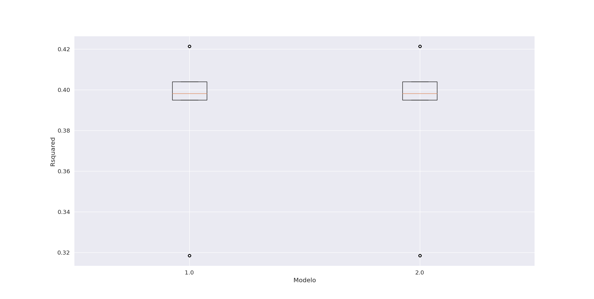

# Proyecto de Minería de Datos

## Portada
- **Nombre del Analista:** Alejandro Borrego Megías
- **Fecha:** 24-12-2023
- **Correo Electrónico:** alejbormeg@gmail.com

## Índice
- [1. Introducción al objetivo del problema y las variables implicadas.](#1-introducción-al-objetivo-del-problema-y-las-variables-implicadas)
- [2. Importación del conjunto de datos y asignación correcta de los tipos de variables.](#2-importación-del-conjunto-de-datos-y-asignación-correcta-de-los-tipos-de-variables)
- [3. Análisis descriptivo del conjunto de datos.](#3-análisis-descriptivo-del-conjunto-de-datos)
  - [3.1 Número de observaciones](#31-número-de-observaciones)
  - [3.2 Número y naturaleza de variables](#32-número-y-naturaleza-de-variables)
  - [3.3 Datos erróneos, etc.](#33-datos-erróneos-etc)
- [4. Corrección de los errores detectados.](#4-corrección-de-los-errores-detectados)
- [5. Análisis de valores atípicos.](#5-análisis-de-valores-atípicos)
  - [5.1 Decisiones tomadas.](#51-decisiones-tomadas)
- [6. Análisis de valores perdidos.](#6-análisis-de-valores-perdidos)
  - [6.1 Estrategias de imputación.](#61-estrategias-de-imputación)
- [7. Transformaciones de variables y relaciones con las variables objetivo.](#7-transformaciones-de-variables-y-relaciones-con-las-variables-objetivo)
- [8. Detección de las relaciones entre las variables input y objetivo.](#8-detección-de-las-relaciones-entre-las-variables-input-y-objetivo)
- [9. Construcción del modelo de regresión lineal.](#9-construcción-del-modelo-de-regresión-lineal)
  - [9.1 Selección de variables clásica](#91-selección-de-variables-clásica)
  - [9.2 Selección de variables aleatoria](#92-selección-de-variables-aleatoria)
  - [9.3 Selección del modelo ganador](#93-selección-del-modelo-ganador)
  - [9.4 Interpretación de los coeficientes de dos variables incluidas en el modelo (una binaria y otra continua)](#94-interpretación-de-los-coeficientes-de-dos-variables-incluidas-en-el-modelo-una-binaria-y-otra-continua)
  - [9.5 Justificación del mejor modelo y medición de la calidad del mismo](#95-justificación-del-mejor-modelo-y-medición-de-la-calidad-del-mismo)
- [10. Construcción del modelo de regresión logística.](#10-construcción-del-modelo-de-regresión-logística)
  - [10.1 Selección de variables clásica](#101-selección-de-variables-clásica)
  - [10.2 Selección de variables aleatoria](#102-selección-de-variables-aleatoria)
  - [10.3 Selección del modelo ganador](#103-selección-del-modelo-ganador)
  - [10.4 Determinación del punto de corte óptimo](#104-determinación-del-punto-de-corte-óptimo)
  - [10.5 Interpretación de los coeficientes de dos variables incluidas en el modelo (una binaria y otra continua)](#105-interpretación-de-los-coeficientes-de-dos-variables-incluidas-en-el-modelo-una-binaria-y-otra-continua)
  - [10.6 Justificación del mejor modelo y medición de la calidad del mismo](#106-justificación-del-mejor-modelo-y-medición-de-la-calidad-del-mismo)


## 1. Introducción al objetivo del problema y las variables implicadas.

En el marco de la investigación y análisis demográfico y político, se aborda el desafío de comprender y prever los patrones de abstención en las elecciones municipales en España. La abstención electoral, medida a través del porcentaje de abstención, es una variable crucial que refleja la participación ciudadana en el proceso democrático.

El conjunto de datos utilizado, denominado "DatosEleccionesEspaña.xlsx", contiene información demográfica detallada sobre los municipios de España, así como los resultados de las últimas elecciones. Este conjunto incluye variables que abarcan desde características poblacionales hasta resultados de votación, proporcionando una visión integral de los factores que podrían influir en la abstención.

El objetivo principal de este análisis es desarrollar dos modelos predictivos: uno de regresión lineal para predecir el porcentaje de abstención y otro de regresión logística para prever la probabilidad de una alta abstención. Estos modelos tienen el propósito de identificar patrones y relaciones significativas entre las diversas variables demográficas y los resultados electorales, lo que podría ayudar a comprender mejor los factores que afectan la participación electoral.

Las variables consideradas serán las siguientes: 

| Variable                        | Descripción                                                                                                  |
|---------------------------------|--------------------------------------------------------------------------------------------------------------|
| Name                            | Nombre del municipio                                                                                        |
| CodigoProvincia                 | Código de la provincia (coincide con los dos primeros dígitos del código postal). Toma 52 valores distintos |
| CCAA                            | Comunidad autónoma a la que pertenece el municipio                                                           |
| Population                      | Población del municipio en 2016                                                                            |
| TotalCensus                     | Población en edad de votar en 2016                                                                         |
| AbstencionAlta                  | Variable dicotómica que toma el valor 1 si el porcentaje de abstención es superior al 30%, y 0 en otro caso   |
| AbstentionPtge                  | Porcentaje de abstención                                                                                  |
| Age_0-4_Ptge                    | Porcentaje de ciudadanos con menos de 5 años                                                               |
| Age_under19_Ptge                | Porcentaje de ciudadanos con menos de 19 años                                                              |
| Age_19_65_pct                   | Porcentaje de ciudadanos entre 19 y 65 años                                                                |
| Age_over65_pct                  | Porcentaje de ciudadanos con más de 65 años                                                               |
| WomanPopulationPtge             | Porcentaje de mujeres                                                                                     |
| ForeignersPtge                  | Porcentaje de extranjeros                                                                                 |
| SameComAutonPtge                | Porcentaje de ciudadanos que reside en la misma provincia en la que nacieron                              |
| SameComAutonDiffProvPtge         | Porcentaje de ciudadanos que reside en la misma CCAA en la que nacieron, pero distinta provincia            |
| DifComAutonPtge                 | Porcentaje de ciudadanos que reside en la distinta CCAA de la que nacieron                                 |
| UnemployLess25_Ptge             | Porcentaje de parados de menos de 25 años                                                                  |
| Unemploy25_40_Ptge              | Porcentaje de parados entre 25 y 40 años                                                                   |
| UnemployMore40_Ptge             | Porcentaje de parados de más de 40 años                                                                    |
| AgricultureUnemploymentPtge     | Porcentaje de parados en el sector de la agricultura                                                        |
| IndustryUnemploymentPtge         | Porcentaje de parados en el sector de la industria                                                          |
| ConstructionUnemploymentPtge     | Porcentaje de parados en el sector de la construcción                                                       |
| ServicesUnemploymentPtge         | Porcentaje de parados en el sector servicios                                                               |
| totalEmpresas                   | Número total de empresas en el municipio                                                                   |
| Industria                        | Número de empresas del sector industrial en el municipio                                                    |
| Construccion                     | Número de empresas del sector de la construcción en el municipio                                           |
| ComercTTEHosteleria              | Número de empresas dedicadas a comercio, transporte u hostelería en el municipio                            |
| Servicios                        | Número de empresas del sector servicios en el municipio                                                      |
| ActividadPpal                    | Actividad principal de las actividades del municipio (Industria, Construcción, ComercTTEHosteleria, Servicios y Otros) |
| inmuebles                        | Número de inmuebles en el municipio                                                                        |
| Pob2010                         | Población en el municipio en 2010                                                                          |
| SUPERFICIE                       | Superficie del municipio                                                                                   |
| densidad                         | Densidad de población del municipio: MuyBaja (<1 hab/ha), Baja (entre 1 y 5 hab/ha), Alta (>5 hab/ha)        |
| PobChange_pct                   | Porcentaje de cambio en la población (valores negativos indican que ha disminuido). Respecto a las anteriores elecciones |
| PersonasInmueble                 | Número medio de personas que habita un inmueble                                                            |
| Explotaciones                    | Número de explotaciones agrícolas en el municipio                                                           |


En última instancia, este estudio busca proporcionar información valiosa para entender los determinantes de la participación electoral en los municipios españoles, contribuyendo así a la toma de decisiones informada en el ámbito político y social.


## 2. Importación del conjunto de datos y asignación correcta de los tipos de variables.

La base de datos se guarda en la carpeta `src/data` y se realiza la importación del conjunto de datos con la librería `Pandas` de Python. Una vez hecho esto eliminamos las variables objetivo relacionadas con el porcentaje de Izquierda, Derecha y otros, tanto continuas como categóricas:

```python
# Cargo los datos
datos = pd.read_excel('src/data/DatosEleccionesEspana.xlsx')

# Eliminamos las variables que no usaremos
variables_a_eliminar = ["Izda_Pct", "Dcha_Pct", "Otros_Pct", "Izquierda", "Derecha"]

datos = datos.drop(columns=variables_a_eliminar)
```

Comprobamos que todas las variables tienen los tipos correctos ejecutando: 

```python
print(datos.dtypes)
```
Obteniendo:

```bash
Name                             object
CodigoProvincia                   int64
CCAA                             object
Population                        int64
TotalCensus                       int64
AbstentionPtge                  float64
AbstencionAlta                    int64
Age_0-4_Ptge                    float64
Age_under19_Ptge                float64
Age_19_65_pct                   float64
Age_over65_pct                  float64
WomanPopulationPtge             float64
ForeignersPtge                  float64
SameComAutonPtge                float64
SameComAutonDiffProvPtge        float64
DifComAutonPtge                 float64
UnemployLess25_Ptge             float64
Unemploy25_40_Ptge              float64
UnemployMore40_Ptge             float64
AgricultureUnemploymentPtge     float64
IndustryUnemploymentPtge        float64
ConstructionUnemploymentPtge    float64
ServicesUnemploymentPtge        float64
totalEmpresas                   float64
Industria                       float64
Construccion                    float64
ComercTTEHosteleria             float64
Servicios                       float64
ActividadPpal                    object
inmuebles                       float64
Pob2010                         float64
SUPERFICIE                      float64
Densidad                         object
PobChange_pct                   float64
PersonasInmueble                float64
Explotaciones                     int64

```

Como vemos, las variables categóricas (Name, CCAA, ActividadPpal, Densidad) tienen el tipo `object` correctamente, mientras que las demás son numéricas todas, algunas enteros y otras en coma flotante.

## 3. Análisis descriptivo del conjunto de datos.

Ejecutando `datos.shape` observamos que las dimensiones del dataframe cargado son de `(8119, 36)`, lo que implica un total de 8119 ejemplos en la base de datos y un total de 36 variables (incluyendo las variables objetivo) que analizar y limpiar.

Separamos las variables en variables numéricas y categóricas:

```python
# Seleccionar las columnas numéricas del DataFrame
numericas = datos.select_dtypes(include=['int', 'int32', 'int64','float', 'float32', 'float64']).columns

# Seleccionar las columnas categóricas del DataFrame
categoricas = [variable for variable in variables if variable not in numericas]
```

Obtenemos un total de 32 variables numéricas y 4 categóricas. Tras esto procedemos a un análisis más exhaustivo de las distintas variables. 

### Análisis variables categóricas

Para las variables categóricas emplearemos la función `analizar_variables_categoricas` del fichero `src/FuncionesMineria.py`. Esta función nos devuelve para cada variable categórica el número de ocurrencias para cada categoría así como el porcentaje que representa dentro del total de datos:

```python
# Frecuencias de los valores en las variables categóricas
analisis_categoricas = analizar_variables_categoricas(datos)

print(analisis_categoricas)
```

El resultado obtenido es el siguiente:

```bash
{'Name':           n         %
La Zarza           2  0.000246
Sada               2  0.000246
Castejón           2  0.000246
Moya               2  0.000246
Rebollar           2  0.000246
...               ..       ...
Navia de Suarna    1  0.000123
Muras              1  0.000123
Monterroso         1  0.000123
Monforte de Lemos  1  0.000123
Zuñeda             1  0.000123

[8102 rows x 2 columns], 
'CCAA':          n         %
CastillaLeón    2248  0.276881
Cataluña         947  0.116640
CastillaMancha   919  0.113191
Andalucía        773  0.095209
Aragón           731  0.090036
ComValenciana    542  0.066757
Extremadura      387  0.047666
Galicia          314  0.038675
Navarra          272  0.033502
PaísVasco        251  0.030915
Madrid           179  0.022047
Rioja            174  0.021431
Cantabria        102  0.012563
Canarias          88  0.010839
Asturias          78  0.009607
Baleares          67  0.008252
Murcia            45  0.005543
Ceuta              1  0.000123
Melilla            1  0.000123, 
'ActividadPpal':      n         %
Otro                 4932  0.607464
ComercTTEHosteleria  2540  0.312846
Servicios             620  0.076364
Construccion           14  0.001724
Industria              13  0.001601, 
'Densidad': n         %
MuyBaja  6417  0.790368
Baja     1053  0.129696
Alta      557  0.068605
?          92  0.011331
}
```

De aquí podemos extraer las siguientes conclusiones:

- La variable "Name" suele presentar una única ocurrencia por clase, a excepción de algunos municipios que presentan 2 ocurrencias, esto no se trata de duplicados pues analizando los ejemplos encontramos casos como el del municipio de La Zarza que en España existe un municipio con ese nombre en Castilla y León y en Extremadura, o Sada en Galicia y Navarra.

- La variable "CCAA" presenta clases con una gran representación en el dataset (como es el caso de Castilla y León con el 27,6% de ocurrencias) y otras con una representación muy baja como son Ceuta y Melilla con unicamente una ocurrencia (pues se tratan de ciudades autonómicas). Esto implicará en futuros procesos agrupar de alguna forma las clases poco representadas.

- La variable "ActividadPpal" presenta 5 posibles valores ("Otro", "ComercTTEHosteleria", "Servicios", "Construccion", "Industria"). Estas clases parecen correctas aunque en el caso de Construccion e Industria se encuentran poco representadas.

- La variable "Densidad" presenta 4 posibles valores ("MuyBaja", "Baja", "Alta", "?") y detectamos un error, pues para representar los valores perdidos emplean "?" lo cual va a suponer una transformación en estos datos para procesarlos correctamente.

### Análisis de variables numéricas

<!-- En primer lugar, para cada variable numérica, vemos la cantidad de ocurrencias por valor, con el objetivo de ver si es posible transformar alguna de estas a categórica. para ello empleamos la función `cuentaDistintos` del fichero `src/FuncionesMineria.py`. Observamos que a excepción de la variable "AbstencionAlta" (que solo toma dos valores 1 y 0) y "CodigoProvincia" (que toma 52 valores distintos) las demás no vale la pena considerarlas categóricas. No obstante una de ellas se trata de variable o -->

Para el análisis de las variables numéricas ejecutamos el siguiente código:

```python
# Descriptivos variables numéricas mediante función describe() de Python
descriptivos_num = datos.describe().T

# Añadimos más descriptivos a los anteriores
for num in numericas:
    descriptivos_num.loc[num, "Asimetria"] = datos[num].skew()
    descriptivos_num.loc[num, "Kurtosis"] = datos[num].kurtosis()
    descriptivos_num.loc[num, "Rango"] = np.ptp(datos[num].dropna().values)

print(descriptivos_num)
```

Obteniendo los siguientes resultados:

| Variable                      | Count  | Mean      | Std        | Min     | 25%     | 50%     | 75%     | Max      | Asimetria | Kurtosis  | Rango       |
|-------------------------------|--------|-----------|------------|---------|---------|---------|---------|----------|-----------|-----------|-------------|
| CodigoProvincia               | 8119.0 | 26.67     | 14.90      | 1.00    | 13.00   | 26.00   | 41.00   | 52.00    | 0.01      | -1.32     | 51.00       |
| Population                    | 8119.0 | 5741.85   | 46215.20   | 5.00    | 166.00  | 549.00  | 2427.50 | 3141991.00 | 45.99     | 2816.86   | 3141986.00  |
| TotalCensus                   | 8119.0 | 4260.67   | 34428.89   | 5.00    | 140.00  | 447.00  | 1846.50 | 2363829.00 | 46.51     | 2890.84   | 2363824.00  |
| AbstentionPtge                | 8119.0 | 26.51     | 7.54       | 0.00    | 21.68   | 26.43   | 31.48   | 57.58    | -0.05     | 0.50      | 57.58       |
| AbstencionAlta                | 8119.0 | 0.31      | 0.46       | 0.00    | 0.00    | 0.00    | 1.00    | 1.00     | 0.81      | -1.34     | 1.00        |
| Age_0-4_Ptge                  | 8119.0 | 3.02      | 2.05       | 0.00    | 1.39    | 2.98    | 4.53    | 13.25    | 0.34      | -0.21     | 13.25       |
| Age_under19_Ptge              | 8119.0 | 13.57     | 6.78       | 0.00    | 8.33    | 13.89   | 19.06   | 33.70    | -0.10     | -0.79     | 33.70       |
| Age_19_65_pct                 | 8119.0 | 57.37     | 6.82       | 23.46   | 53.85   | 58.66   | 61.82   | 100.00   | -0.81     | 2.16      | 76.54       |
| Age_over65_pct                | 8119.0 | 29.07     | 11.75      | 0.00    | 19.82   | 27.56   | 36.91   | 76.47    | 0.60      | 0.08      | 76.47       |
| WomanPopulationPtge           | 8119.0 | 47.30     | 4.36       | 11.77   | 45.73   | 48.49   | 50.00   | 72.68    | -1.67     | 5.80      | 60.92       |
| ForeignersPtge                | 8119.0 | 5.62      | 7.35       | -8.96   | 1.06    | 3.59    | 8.18    | 71.47    | 2.50      | 11.35     | 80.43       |
| SameComAutonPtge              | 8119.0 | 81.63     | 12.29      | 0.00    | 75.81   | 84.49   | 90.46   | 127.16   | -1.52     | 3.47      | 127.16      |
| SameComAutonDiffProvPtge      | 8119.0 | 4.34      | 6.39       | 0.00    | 0.68    | 2.19    | 5.28    | 67.31    | 3.29      | 14.56     | 67.31       |
| DifComAutonPtge               | 8119.0 | 10.73     | 8.85       | 0.00    | 4.93    | 8.27    | 13.90   | 100.00   | 2.43      | 9.66      | 100.00      |
| UnemployLess25_Ptge           | 8119.0 | 7.32      | 9.41       | 0.00    | 0.00    | 5.88    | 10.47   | 100.00   | 4.15      | 31.66     | 100.00      |
| Unemploy25_40_Ptge            | 8119.0 | 37.00     | 20.32      | 0.00    | 28.57   | 39.94   | 46.67   | 100.00   | 0.21      | 1.41      | 100.00      |
| UnemployMore40_Ptge           | 8119.0 | 50.18     | 22.80      | 0.00    | 41.67   | 50.00   | 60.04   | 100.00   | -0.23     | 0.86      | 100.00      |
| AgricultureUnemploymentPtge   | 8119.0 | 8.40      | 12.96      | 0.00    | 0.00    | 3.49    | 11.73   | 100.00   | 3.23      | 15.58     | 100.00      |
| IndustryUnemploymentPtge      | 8119.0 | 10.01     | 12.53      | 0.00    | 0.00    | 7.14    | 14.29   | 100.00   | 3.09      | 16.05     | 100.00      |
| ConstructionUnemploymentPtge  | 8119.0 | 10.84     | 13.28      | 0.00    | 0.00    | 8.33    | 14.29   | 100.00   | 3.09      | 14.62     | 100.00      |
| ServicesUnemploymentPtge      | 8119.0 | 58.65     | 24.26      | 0.00    | 50.00   | 62.02   | 72.12   | 100.00   | -0.81     | 0.80      | 100.00      |
| totalEmpresas                 | 8114.0 | 398.60    | 4219.37    | 0.00    | 7.00    | 30.00   | 147.00  | 299397.00 | 53.70     | 3474.99   | 299392.00   |
| Industria                     | 7931.0 | 23.42     | 158.61     | 0.00    | 0.00    | 0.00    | 14.00   | 10521.00  | 44.27     | 2644.34   | 10520.00    |
| Construccion                  | 7980.0 | 48.88     | 421.86     | 0.00    | 0.00    | 0.00    | 25.00   | 30343.00  | 52.58     | 3506.59   | 30343.00    |
| ComercTTEHosteleria           | 8110.0 | 146.74    | 1233.02    | 0.00    | 0.00    | 0.00    | 65.00   | 80856.00  | 45.41     | 2649.23   | 80855.00    |
| Servicios                     | 8057.0 | 172.15    | 2446.81    | 0.00    | 0.00    | 0.00    | 40.00   | 177677.00 | 57.50     | 3834.08   | 177677.00   |
| inmuebles                     | 7981.0 | 3246.16   | 24314.71   | 6.00    | 180.00  | 486.00  | 1589.00 | 1615548.00 | 44.55     | 2645.97   | 1615542.00  |
| Pob2010                       | 8112.0 | 5795.81   | 47535.68   | 5.00    | 177.75  | 582.00  | 2483.00 | 3273049.00 | 47.17     | 2942.10   | 3273044.00  |
| SUPERFICIE                    | 8110.0 | 6214.70   | 9218.19    | 2.58    | 1839.19 | 3487.74 | 6893.88 | 175022.91 | 6.07      | 62.34     | 175020.33   |
| PobChange_pct                 | 8112.0 | -4.90     | 10.38      | -52.27  | -10.40  | -4.96   | 0.09    | 138.46   | 1.51      | 15.10     | 190.73      |
| PersonasInmueble              | 7981.0 | 1.30      | 0.57       | 0.11    | 0.85    | 1.25    | 1.73    | 3.33     | 0.26      | -0.63     | 3.22        |
| Explotaciones                 | 8119.0 | 2447.20   | 15062.74   | 1.00    | 22.00   | 52.00   | 137.00  | 99999.00  | 6.32      | 37.99     | 99998.00    |

Todos los resultados parecen estar dentro de la normalidad a excepción de: 

- Para la variable "Explotaciones" el valor máximo que se indica es de 99999.00, lo cual parece incorrecto y podría estar refiríendose a valores perdidos.

- Las variables "ForeignersPtge", "SameComAutonPtge" y "PobChange_pct" presentan valores fuera de rango, como pueden observarse en sus valores máximos.


## 4. Corrección de los errores detectados.

Para corregir los errores detectados ejecutamos el siguiente código: 

```python
# A veces los 'nan' vienen como como una cadena de caracteres, los modificamos a perdidos.
for x in categoricas:
    datos[x] = datos[x].replace('nan', np.nan) 

# Missings no declarados variables cualitativas (NSNC, ?)
datos['Densidad'] = datos['Densidad'].replace('?', np.nan)

# Missings no declarados variables cuantitativas (-1, 99999)
datos['Explotaciones'] = datos['Explotaciones'].replace(99999, np.nan)

# Valores fuera de rango
datos['ForeignersPtge'] = [x if 0 <= x <= 100 else np.nan for x in datos['ForeignersPtge']]
datos['SameComAutonPtge'] = [x if 0 <= x <= 100 else np.nan for x in datos['SameComAutonPtge']]
datos['PobChange_pct'] = [x if x <= 100 else np.nan for x in datos['PobChange_pct']]
```

Con esto corregimos todos los errores detectados en variables Numéricas y categóricas y convertimos los valores extraños a valores perdidos para un posterior tratamiento de los mismos.

## 5. Análisis de valores atípicos.
Se realiza in recuento de los valores atípicos con la función `atipicosAmissing` del fichero `src/FuncionesMineria.py`, con dicha función, dependiendo de si la variable numérica que se analiza es simétrica o asimétrica se calculan los atípicos con la regla de la desviación típoca (si es simétrica) o con la Desviación Absoluta de la Mediana (MAD). Además se calculan posibles valores atípicos con la regla de los cuartiles. El código empleado s el siguiente: 

```python
# Cuento el porcentaje de atipicos de cada variable. 
resultados = {x: atipicosAmissing(datos_input[x])[1] / len(datos_input) for x in numericas_input}
```

El resultado formateado es el siguiente:

| Variable                      | Proporción de Atípicos     |
|-------------------------------|-----------|
| CodigoProvincia               | 0.0000    |
| Population                    | 0.0993    |
| TotalCensus                   | 0.0962    |
| Age_0-4_Ptge                  | 0.0000    |
| Age_under19_Ptge              | 0.0000    |
| Age_19_65_pct                 | 0.0029    |
| Age_over65_pct                | 0.0000    |
| WomanPopulationPtge           | 0.0026    |
| ForeignersPtge                | 0.0000    |
| SameComAutonPtge              | 0.0000    |
| SameComAutonDiffProvPtge      | 0.0203    |
| DifComAutonPtge               | 0.0049    |
| UnemployLess25_Ptge           | 0.0032    |
| Unemploy25_40_Ptge            | 0.0000    |
| UnemployMore40_Ptge           | 0.0000    |
| AgricultureUnemploymentPtge   | 0.0200    |
| IndustryUnemploymentPtge      | 0.0059    |
| ConstructionUnemploymentPtge  | 0.0065    |
| ServicesUnemploymentPtge      | 0.0000    |
| totalEmpresas                 | 0.0000    |
| Industria                     | 0.0000    |
| Construccion                  | 0.0000    |
| ComercTTEHosteleria           | 0.0000    |
| Servicios                     | 0.0000    |
| inmuebles                     | 0.0000    |
| Pob2010                       | 0.0000    |
| SUPERFICIE                    | 0.0000    |
| PobChange_pct                 | 0.0081    |
| PersonasInmueble              | 0.0000    |
| Explotaciones                 | 0.0000    |

Como podemos ver la mayoría de variables no presentan valores atípicos y las que los presentan son valores muy bajos, siendo el máximo 10% aproximadamente para la variable "Population" y "TotalCensus". Por ello resolvemos transformar todos los valores atípicos a valores perdidos con el siguiente código:

```python
# Modifico los atipicos como missings
for x in numericas_input:
    datos_input[x] = atipicosAmissing(datos_input[x])[0]
```

## 6. Análisis de valores perdidos.

Tras las transformaciones aplicadas y el tratamiento de valores atípicos, vamos a ver el total de valores perdidos por variable. Para ello ejecutamos el siguiente código:

```python
variables = list(datos.columns)  
print(datos[variables].isna().sum())
```

El resultado es el siguiente:

| Variable                      | Missing Values |
|-------------------------------|-----------------|
| CodigoProvincia               | 0               |
| CCAA                          | 0               |
| Population                    | 0               |
| TotalCensus                   | 0               |
| AbstentionPtge                | 0               |
| AbstencionAlta                | 0               |
| Age_0-4_Ptge                  | 0               |
| Age_under19_Ptge              | 0               |
| Age_19_65_pct                 | 0               |
| Age_over65_pct                | 0               |
| WomanPopulationPtge           | 0               |
| ForeignersPtge                | 653             |
| SameComAutonPtge              | 3               |
| SameComAutonDiffProvPtge      | 0               |
| DifComAutonPtge               | 0               |
| UnemployLess25_Ptge           | 0               |
| Unemploy25_40_Ptge            | 0               |
| UnemployMore40_Ptge           | 0               |
| AgricultureUnemploymentPtge   | 0               |
| IndustryUnemploymentPtge      | 0               |
| ConstructionUnemploymentPtge  | 0               |
| ServicesUnemploymentPtge      | 0               |
| totalEmpresas                 | 5               |
| Industria                     | 188             |
| Construccion                  | 139             |
| ComercTTEHosteleria           | 9               |
| Servicios                     | 62              |
| ActividadPpal                 | 0               |
| inmuebles                     | 138             |
| Pob2010                       | 7               |
| SUPERFICIE                    | 9               |
| Densidad                      | 92              |
| PobChange_pct                 | 9               |
| PersonasInmueble              | 138             |
| Explotaciones                 | 189             |

"ForeignersPtge" muestra el máximo con 653, pero ninguna variable tiene una cantidad excesiva de valores perdidos en comparación con el conjunto total. Vamos a ver a continuación la correlación entre los valores perdidos de las diferentes variables:


Destacan correlaciones significativas entre algunas variables. Por ejemplo, la alta correlación de 0.97 entre "Population" y "TotalCensus" es lógica, ya que ambos representan conceptos similares en el contexto electoral, donde el censo deriva de la población local. También, la correlación perfecta de 1.0 entre "PersonasInmueble" y "Inmuebles" indica una dependencia directa entre ambas, siendo la primera derivada de la segunda.

Además, se observan relaciones notables entre sectores económicos, como la correlación de 0.82 entre "Industria" y "Construccion," reflejando una estrecha relación sectorial. Otras correlaciones relevantes incluyen 0.85 entre "TotalEmpresas" y "Pob210," y 0.63 entre "ComercTTEHosteleria" y "Pob210," indicando posibles interacciones demográficas y económicas en el análisis territorial. Este análisis resalta conexiones sustanciales entre variables, proporcionando insights para comprender mejor la estructura de los datos y las relaciones subyacentes.

A continuación creamos una nueva variable "prop_missings" para recoger la proporción de valores perdidos por cada observación, de cara a eliminar posibles observaciones con demasiados valores perdidos (más del 50%). Para ello usamos el siguiente código:

```python
datos_input['prop_missings'] = datos_input.isna().mean(axis = 1)

# Elimino las observaciones con mas de la mitad de datos missings (no hay ninguna)
eliminar = datos_input['prop_missings'] > 0.5
datos_input = datos_input[~eliminar]
varObjBin = varObjBin[~eliminar]
varObjCont = varObjCont[~eliminar]

# Transformo la nueva variable en categórica (ya que tiene pocos valores diferentes)
datos_input["prop_missings"] = datos_input["prop_missings"].astype(str)
```

Estadísticas de la nueva variable:

Número de observaciones (count): 8119.
- Media (mean): 0.014306, lo que indica que, en promedio, alrededor del 1.43% de los datos están ausentes en cada observación.
- Desviación estándar (std): 0.025718, señalando la variabilidad en la proporción de valores faltantes entre las observaciones.
Valor mínimo (min): 0, ya que no hay ninguna observación sin valores faltantes.
- Primer cuartil (25%): 0, indicando que el 25% de las observaciones tienen ningún valor faltante.
- Mediana (50%): 0, denotando que la mitad de las observaciones tienen un 0% de valores faltantes.
- Tercer cuartil (75%): 0.030303, revelando que el 75% de las observaciones tienen hasta un 3.03% de valores faltantes.
- Valor máximo (max): 0.333333, que representa la proporción máxima de valores faltantes en una observación, equivalente al 33.33%

Se opta por convertirla en categórica debido a los pocos valores distintos que toma.

### Imputación de valores faltantes

En el proceso de imputación de valores faltantes, se aborda tanto la imputación para variables cuantitativas como para variables cualitativas.

#### Variables Cuantitativas:
Para las variables cuantitativas, se evalúa la simetría de cada variable mediante su coeficiente de asimetría. Si la simetría es menor a 1, se realiza la imputación utilizando la media de la variable. En cambio, si la simetría es igual o mayor a 1, se opta por la imputación mediante la mediana. Esta distinción se basa en la forma de la distribución, buscando preservar la representatividad de los datos centrales. El código empleado es el siguiente: 

```python
for x in numericas_input:
    simetria = datos_input[x].skew()
    if simetria < 1:
        datos_input[x] = ImputacionCuant(datos_input[x], 'media')
    else:
        datos_input[x] = ImputacionCuant(datos_input[x], 'mediana')
```
#### Variables Cualitativas:
En el caso de las variables cualitativas, la imputación se lleva a cabo utilizando la moda, que representa el valor más frecuente en la variable. Esta elección se fundamenta en la naturaleza discreta de las variables cualitativas y en la búsqueda de preservar la tendencia central del conjunto de datos. El código empleado es el siguiente:

```python
for x in categoricas_input:
    datos_input[x] = ImputacionCuali(datos_input[x], 'moda')
```

Finalmente, se realiza una verificación post-imputación para asegurar que no queden valores faltantes en el conjunto de datos resultante. Este procedimiento garantiza la coherencia y completitud de la información, preparando los datos para análisis subsiguientes:

```bash
CodigoProvincia                 0
CCAA                            0
Population                      0
TotalCensus                     0
Age_0-4_Ptge                    0
Age_under19_Ptge                0
Age_19_65_pct                   0
Age_over65_pct                  0
WomanPopulationPtge             0
ForeignersPtge                  0
SameComAutonPtge                0
SameComAutonDiffProvPtge        0
DifComAutonPtge                 0
UnemployLess25_Ptge             0
Unemploy25_40_Ptge              0
UnemployMore40_Ptge             0
AgricultureUnemploymentPtge     0
IndustryUnemploymentPtge        0
ConstructionUnemploymentPtge    0
ServicesUnemploymentPtge        0
totalEmpresas                   0
Industria                       0
Construccion                    0
ComercTTEHosteleria             0
Servicios                       0
ActividadPpal                   0
inmuebles                       0
Pob2010                         0
SUPERFICIE                      0
Densidad                        0
PobChange_pct                   0
PersonasInmueble                0
Explotaciones                   0
prop_missings                   0
dtype: int64
```

## 7. Transformaciones de variables y relaciones con las variables objetivo.

### Normalización de las variables
Como paso previo, vamos a normalizar los valores de las variables pues las escalas difieren mucho entre las propias variables input para los modelos de Regresión Lineal y Logística. Por ello vamos a llevar todos los valores entre 0 y 1 con media 0 y std 1. Para ello usamos `MinMaxScaler` de la librería `Scikit Learn` de python, así llevamos todas las variables numéricas al rango de valores 0-1.Esto se logra restando el valor mínimo de la característica y luego dividiendo por el rango (el máximo menos el mínimo) de la característica:

```python
# Inicializamos el normalizador
scaler = MinMaxScaler()

# Normalizamos columnas numéricas
datos_input[numeric_columns] = scaler.fit_transform(datos_input[numeric_columns])
```

### Importancia variables y relación con variable objetivo

Para ver la importancia de las variables vamos a usar el estadístico V de Cramer para comparar cada variable input del problema con la variable objetivo, ya sea numérica o categórica. Para ello empleamos la función ``graficoVcramer``. Cabe destacar, que el estadístico V de Cramer se usa para pares de variables categóricas, por ello para extraer los estadísticos primero se pasan las variables numéricas a categóricas agrupándolas por intervalos.

#### Gráfico V Cramer para Variable objetivo Continua


- Las variables con valores más altos podrían considerarse para el análisis.
- Las variables que muestran un valor más bajo de Cramér V en el gráfico podrían tener una influencia limitada en la variable objetivo `AbstentionPtge` y podrían ser candidatas a excluirse del modelo de regresión lineal.
- No obstante realizaremos un análisis más detallado, utilizando el coeficiente de correlación de Pearson para las variables continuas.

#### Gráfico V Cramer para variable objetivo categórica


- Se observa una variación considerable en la fuerza de la asociación entre las variables independientes categóricas y la variable objetivo `AbstencionAlta`, medida por el valor de Cramér V.
- Las variables que tienen los valores más altos de Cramér V, podrían ser los mejores predictores para la variable objetivo en un modelo de Regresión Logística.
- Las variables con valores más bajos de Cramér V parecen tener menos asociación y podrían no ser significativas en el modelo.


## 8. Detección de las relaciones entre las variables input y objetivo.

### Regresión Logística

Vamos a analizar algunas de las variables continuas y categóricas más relevantes:

#### Análisis de la Variable "Población" para Predecir "AbstencionAlta"

Se presentan dos visualizaciones para entender la distribución de la variable "Población" en relación con la variable objetivo binaria "AbstencionAlta" en un contexto de regresión logística.


El boxplot muestra la distribución de la variable "Población" para los dos grupos de "AbstencionAlta":

- **Grupo 0 (Abstención baja)**: La mediana es baja y hay una concentración de datos en los valores inferiores, lo que indica que una menor proporción de la población está asociada con una menor abstención.
- **Grupo 1 (Abstención alta)**: La mediana es más alta en comparación con el Grupo 0, lo que sugiere que una mayor proporción de la población podría estar relacionada con una mayor abstención. La presencia de valores atípicos sugiere variaciones significativas dentro del grupo, debido a la gran diferencia de población que hay entre municipios con pocos cientos de habitantes y ciudades con miles o incluso millones de habitantes.

El histograma de densidad compara la distribución de la variable "Población" entre los dos grupos:

- **Grupo 0 (Abstención baja)**: La distribución es más puntiaguda y estrecha, indicando menor variabilidad y una tendencia hacia valores más bajos de "Población".
- **Grupo 1 (Abstención alta)**: La distribución es más plana y extendida, lo que implica una mayor variabilidad y un alcance más amplio de valores de "Población".

La combinación de ambas visualizaciones sugiere que la variable "Población" podría tener un papel en la predicción de "AbstencionAlta". Específicamente:

- **Baja Abstención (0)**: Se asocia con valores más bajos de "Población" y menos variabilidad.
- **Alta Abstención (1)**: Se asocia con valores más altos y mayor variabilidad en la "Población".


#### Análisis de la Variable "Porcentaje de Mayores de 65 Años" para Predecir "AbstencionAlta"

Se analizan dos visualizaciones para comprender la distribución del "Porcentaje de Mayores de 65 Años" y su relación con la variable objetivo "AbstencionAlta", que indica si la abstención es alta (más del 30%) o no.


El boxplot muestra las diferencias en la distribución del porcentaje de personas mayores de 65 años entre las áreas con baja y alta abstención:

- **Grupo 0 (Abstención baja)**: Presenta una mediana más baja y menos valores atípicos, lo que sugiere que las áreas con un menor porcentaje de mayores de 65 años tienden a tener menores tasas de abstención.
- **Grupo 1 (Abstención alta)**: Tiene una mediana más alta y una cantidad significativa de valores atípicos, lo que indica que las áreas con un mayor porcentaje de mayores de 65 años podrían estar más inclinadas a tener una alta abstención.

El histograma de densidad compara la frecuencia del porcentaje de mayores de 65 años entre los dos grupos objetivo:

- **Grupo 0 (Abstención baja)**: La curva es más alta y estrecha alrededor de valores más bajos, lo que indica una concentración de áreas con un porcentaje menor de mayores y baja abstención.
- **Grupo 1 (Abstención alta)**: La distribución es más amplia y menos puntiaguda, reflejando una mayor variabilidad en el porcentaje de mayores de 65 años en las áreas con alta abstención.

Las visualizaciones indican que existe una relación entre el "Porcentaje de Mayores de 65 Años" y la variable "AbstencionAlta". Específicamente:

- Áreas con un **porcentaje más bajo** de mayores de 65 años tienden a tener **menor abstención**.
- Áreas con un **porcentaje más alto** de mayores de 65 años muestran una tendencia a tener **mayor abstención**.

Estos hallazgos sugieren que la edad de la población podría ser un factor relevante a considerar en un modelo de regresión logística para predecir patrones de abstención electoral. Será crucial realizar análisis estadísticos adicionales para confirmar la significancia de estas observaciones.

#### Análisis de las Variables "Densidad" y "CCAA"  para predecir "AbstencionAlta"

Se presentan dos gráficos mosaicos que exploran la relación entre la variable "AbstencionAlta" y dos variables categóricas: "Densidad de Población" y la pertenencia a una determinada "Comunidad Autónoma":


- **Densidad Alta**: Se observa una predominancia del valor 1 de "AbstencionAlta", lo que indica que las áreas con una alta densidad de población pueden tener mayores tasas de abstención.
- **Densidad Baja**: Muestra casi un equilibrio perfecto entre valores 0 y 1 para "AbstencionAlta".
- **Densidad Muy Baja**: Muestra una proporción mayor de "AbstencionAlta" igual a 0, sugiriendo que las áreas con menor densidad de población tienden a tener tasas más bajas de abstención.

Estos resultados podrían reflejar diferencias en la accesibilidad a los centros de votación, la efectividad de las campañas de movilización electoral en áreas densamente pobladas o el nivel de compromiso cívico entre zonas urbanas y rurales.

- **Diferencias Regionales**: Hay una variabilidad significativa entre las comunidades autónomas en términos de "AbstencionAlta". "Ceuta" y "Melilla" tienen una mayor frecuencia de abstención alta, mientras que "Valencia" y "Rioja" muestran más tendencia hacia la abstención baja.
- **Consideraciones para Políticas Públicas**: Estas diferencias pueden estar influenciadas por factores socioeconómicos, demográficos, la calidad de las políticas públicas, la efectividad de las instituciones democráticas regionales o diferencias culturales que impactan la participación electoral.

La identificación de estas tendencias puede ser crucial para diseñar estrategias específicas dirigidas a incrementar la participación electoral y abordar las causas de la alta abstención en determinadas áreas o comunidades.

### Regresión Lineal

Calculamos la matriz de correlaciones de las variables numéricas incluyendo la variable continua objetivo: 


La matriz de correlaciones proporciona información valiosa sobre la relación entre la variable objetivo "AbstentionPtge" y un conjunto de variables independientes. También nos permite evaluar la correlación entre las variables independientes para detectar multicolinealidad.

#### Correlaciones con la Variable Objetivo "AbstentionPtge"

- Como podemos observar, ninguna guarda una estrecha correlación con la variable objetivo, las que más tienen son `Age_under19_Ptge` y `PersonasInmueble` (0.33), sugiriendo que un mayor porcentaje de la población en estos segmentos podría estar relacionado con un mayor porcentaje de abstención.
- `Age_over65_pct` muestra una correlación negativa, indicando que las personas de este grupo tienden a tener menores porcentajes de abstención.

#### Correlaciones entre Variables Input

- Podemos obstervar un conjunto de variables input fuertemente correlacionadas entre sí 2 a 2 (con valores superiores a 0.9), por lo que podemos considerar eliminar algunas de esteas variables, son el caso de: "TotalCensus", "Pob2010", "inmuebles", "Servicios", "ComercTTEHosteleria", "Construccion", "Industria", "totalEmpresas".

La matriz de correlaciones muestra relaciones significativas y nos ha proporcionado una base sólida para la selección de variables en nuestro modelo de regresión lineal.

### Transformaciones y eliminación de variables

En primer lugar eliminamos las variables input altamente correlacionadas y además "SUPERFICIE" por no guardar relación con el problema y tener una correlación de prácticamente 0 con la variable objetivo: 

```python
# Eliminamos variables altamente correlacionadas
columns_to_remove = ["TotalCensus", "Pob2010", "inmuebles", "Servicios", "ComercTTEHosteleria", "Construccion", "Industria", "totalEmpresas", "SUPERFICIE", "CodigoProvincia"]
datos_input = datos_input.drop(columns=columns_to_remove)
```

Con el objetivo de maximizar la correlación entre variables input y las variables objetivo ejecutamos la función `Transf_Auto` sobre los datos con el siguiente código: 

```python
# Busco las mejores transformaciones para las variables numericas con respesto a los dos tipos de variables
input_cont = pd.concat([datos_input, Transf_Auto(datos_input[numericas], varObjCont)], axis = 1)
input_bin = pd.concat([datos_input, Transf_Auto(datos_input[numericas], varObjBin)], axis = 1)
```

Finalmente, unimos categorías poco representadas en las variables categóricas de "CCAA" y "ActividadPpal". En concreto unimos Ceuta, Melilla y Murcia por tener una actividad principal similar (Hostelería, servicios u otros) y características similares, y unimos "Construccion" e "Industria" en "ActividadPpal".

```python
datos_input['CCAA'] = datos_input['CCAA'].replace({'Ceuta': 'Murcia_Ceuta_Melilla','Melilla': 'Murcia_Ceuta_Melilla', 'Murcia': 'Murcia_Ceuta_Melilla'})

datos_input['ActividadPpal'] = datos_input['ActividadPpal'].replace({'Construccion': 'Industria_Construccion','Industria': 'Industria_Construccion'})
```

## 9. Construcción del modelo de regresión lineal.
### Selección de variables clásica

En primer lugar preparamos los datos para el problema de regresión. Para ello dividimos nuestro conjunto de datos en dos subconjuntos: train y test. El conjunto de datos original se divide en un 80% para entrenamiento y un 20% para test utilizando la función ``train_test_split`` de sklearn. Esto nos permite entrenar nuestro modelo en un conjunto de datos y evaluar su rendimiento en un conjunto de datos independiente.

Para el entrenamiento de los modelos incluiremos todas las variables continuas incluyendo las transformaciones que maximizan el coeficiente de pearson con la variable continua objetivo y las originales. Además incluimos las variables categóricas y todas las posibles interacciones 2 a 2 entre las variables categóricas (no se incluyen las continuas en las interacciones para no generar un conjunto de posibles variables inabarcable computacionalmente).

#### Selección de variables Forward

El método Forward comienza con un modelo que no incluye ninguna variable predictora y luego agrega una variable a la vez. En cada paso, se selecciona la variable que proporciona la mayor mejora en el criterio de ajuste, que podría ser AIC o BIC, entre otros. Este proceso se repite hasta que no se encuentre ninguna variable que mejore significativamente el criterio de ajuste o hasta que se alcance un criterio de parada predefinido.

#### Selección de variables Backward

El método Backward comienza con un modelo que incluye todas las variables predictoras disponibles y luego elimina una variable a la vez en cada paso. En cada iteración, se elimina la variable que, al ser eliminada, proporciona la mayor mejora en el criterio de ajuste (AIC o BIC). Este proceso continúa hasta que no se pueda eliminar ninguna variable sin empeorar significativamente el criterio de ajuste o hasta que se alcance un criterio de parada.

#### Selección de variables Stepwise

El método Stepwise es una combinación de Forward y Backward. Comienza con un modelo vacío y agrega variables de manera similar al método Forward. Luego, una vez que se han agregado todas las variables, realiza iteraciones para eliminar variables, como en el método Backward. El proceso sigue alternando entre agregar y eliminar variables hasta que se cumpla un criterio de parada.

#### Métricas AIC y BIC

Tanto el AIC (Criterio de Información de Akaike) como el BIC (Criterio de Información Bayesiano) son métricas utilizadas para evaluar la calidad de un modelo estadístico. En el contexto de la selección de variables, se utilizan para comparar modelos con diferentes conjuntos de variables predictoras.

* El AIC penaliza el sobreajuste menos que el BIC y tiende a favorecer modelos más complejos.
* El BIC penaliza el sobreajuste de manera más rigurosa que el AIC y tiende a favorecer modelos más simples.

En la selección de variables, se elige el modelo con el valor más bajo de AIC o BIC, ya que esto indica un mejor equilibrio entre el ajuste del modelo y su complejidad. Estas métricas ayudan a evitar la inclusión de variables redundantes o irrelevantes en el modelo de regresión lineal.

#### Aplicación al problema de Regresión lineal

Sobre el conjunto de train entrenamos un modelo de regresión lineal siguiendo cada algoritmo de los explicados y cada métrica (en total 6 modelos distintos). De estos modelos, como métrica para estudiar la calidad de los mismos se usará el coeficiente R2 tanto sobre el conjunto de entrenamiento como el de test. Además se recogerán el total de parámetros de cada modelo. Usaremos estos parámetros para decidir el mejor modelo. Para ello hacemos uso de las funciones `lm_backward`, `lm_forward`, y `lm_stepwise` de la librería `FuncionesMineria.py`. El código es el siguiente:

```python
# MODELO 1 forward, métrica AIC  con transformaciones con interacciones

modeloForwardAIC_con_trans_con_int = lm_forward(y_train, x_train, var_cont_con_transf, var_categ,
                                interacciones_unicas, 'AIC')

# Resumen del modelo
print(modeloForwardAIC_con_trans_con_int['Modelo'].summary())

# R-squared del modelo para train
print(Rsq(modeloForwardAIC_con_trans_con_int['Modelo'], y_train, modeloForwardAIC_con_trans_con_int['X']))

# Preparo datos test
x_test_modeloForwardAIC_con_trans_con_int = crear_data_modelo(x_test, modeloForwardAIC_con_trans_con_int['Variables']['cont'], 
                                                    modeloForwardAIC_con_trans_con_int['Variables']['categ'], 
                                                    modeloForwardAIC_con_trans_con_int['Variables']['inter'])
# R-squared del modelo para test
print(Rsq(modeloForwardAIC_con_trans_con_int['Modelo'], y_test, x_test_modeloForwardAIC_con_trans_con_int))


# MODELO 2 backward, métrica AIC  con transformaciones con interacciones

modeloBackwardAIC_con_trans_con_int = lm_backward(y_train, x_train, var_cont_con_transf, var_categ,
                                interacciones_unicas, 'AIC')

# Resumen del modelo
print(modeloBackwardAIC_con_trans_con_int['Modelo'].summary())

# R-squared del modelo para train
print(Rsq(modeloBackwardAIC_con_trans_con_int['Modelo'], y_train, modeloBackwardAIC_con_trans_con_int['X']))

# Preparo datos test
x_test_modeloBackwardAIC_con_trans_con_int = crear_data_modelo(x_test, modeloBackwardAIC_con_trans_con_int['Variables']['cont'], 
                                                    modeloBackwardAIC_con_trans_con_int['Variables']['categ'], 
                                                    modeloBackwardAIC_con_trans_con_int['Variables']['inter'])
# R-squared del modelo para test
print(Rsq(modeloBackwardAIC_con_trans_con_int['Modelo'], y_test, x_test_modeloBackwardAIC_con_trans_con_int))

# MODELO 3 Stepwise, métrica AIC  con transformaciones con interacciones

modeloStepAIC_con_trans_con_int = lm_stepwise(y_train, x_train, var_cont_con_transf, var_categ,
                                interacciones_unicas, 'AIC')

# Resumen del modelo
print(modeloStepAIC_con_trans_con_int['Modelo'].summary())

# R-squared del modelo para train
print(Rsq(modeloStepAIC_con_trans_con_int['Modelo'], y_train, modeloStepAIC_con_trans_con_int['X']))

# Preparo datos test
x_test_modeloStepAIC_con_trans_con_int = crear_data_modelo(x_test, modeloStepAIC_con_trans_con_int['Variables']['cont'], 
                                                    modeloStepAIC_con_trans_con_int['Variables']['categ'], 
                                                    modeloStepAIC_con_trans_con_int['Variables']['inter'])
# R-squared del modelo para test
print(Rsq(modeloStepAIC_con_trans_con_int['Modelo'], y_test, x_test_modeloStepAIC_con_trans_con_int))


# MODELO 4 forward, métrica BIC  con transformaciones con interacciones
modeloForwardBIC_con_trans_con_int = lm_forward(y_train, x_train, var_cont_con_transf, var_categ,
                                interacciones_unicas, 'BIC')

# Resumen del modelo
print(modeloForwardBIC_con_trans_con_int['Modelo'].summary())

# R-squared del modelo para train
print(Rsq(modeloForwardBIC_con_trans_con_int['Modelo'], y_train, modeloForwardBIC_con_trans_con_int['X']))

# Preparo datos test
x_test_modeloForwardBIC_con_trans_con_int = crear_data_modelo(x_test, modeloForwardBIC_con_trans_con_int['Variables']['cont'], 
                                                    modeloForwardBIC_con_trans_con_int['Variables']['categ'], 
                                                    modeloForwardBIC_con_trans_con_int['Variables']['inter'])
# R-squared del modelo para test
print(Rsq(modeloForwardBIC_con_trans_con_int['Modelo'], y_test, x_test_modeloForwardBIC_con_trans_con_int))

# MODELO 5 backward, métrica BIC  con transformaciones con interacciones
modeloBackwardBIC_con_trans_con_int = lm_backward(y_train, x_train, var_cont_con_transf, var_categ,
                                interacciones_unicas, 'BIC')

# Resumen del modelo
print(modeloBackwardBIC_con_trans_con_int['Modelo'].summary())

# R-squared del modelo para train
print(Rsq(modeloBackwardBIC_con_trans_con_int['Modelo'], y_train, modeloBackwardBIC_con_trans_con_int['X']))

# Preparo datos test
x_test_modeloBackwardBIC_con_trans_con_int = crear_data_modelo(x_test, modeloBackwardBIC_con_trans_con_int['Variables']['cont'], 
                                                    modeloBackwardBIC_con_trans_con_int['Variables']['categ'], 
                                                    modeloBackwardBIC_con_trans_con_int['Variables']['inter'])
# R-squared del modelo para test
print(Rsq(modeloBackwardBIC_con_trans_con_int['Modelo'], y_test, x_test_modeloBackwardBIC_con_trans_con_int))

# MODELO 6 Stepwise, métrica BIC  con transformaciones con interacciones
modeloStepBIC_con_trans_con_int = lm_stepwise(y_train, x_train, var_cont_con_transf, var_categ,
                                interacciones_unicas, 'BIC')

# Resumen del modelo
print(modeloStepBIC_con_trans_con_int['Modelo'].summary())

# R-squared del modelo para train
print(Rsq(modeloStepBIC_con_trans_con_int['Modelo'], y_train, modeloStepBIC_con_trans_con_int['X']))

# Preparo datos test
x_test_modeloStepBIC_con_trans_con_int = crear_data_modelo(x_test, modeloStepBIC_con_trans_con_int['Variables']['cont'], 
                                                    modeloStepBIC_con_trans_con_int['Variables']['categ'], 
                                                    modeloStepBIC_con_trans_con_int['Variables']['inter'])
# R-squared del modelo para test
print(Rsq(modeloStepBIC_con_trans_con_int['Modelo'], y_test, x_test_modeloStepBIC_con_trans_con_int))
```

### Selección de variables aleatoria

En el contexto de nuestro problema de regresión lineal, hemos diseñado un procedimiento que implica la selección aleatoria de variables en un modelo de regresión lineal entrenado de manera aleatoria. Este enfoque se basa en la idea de explorar diferentes combinaciones de variables predictoras para evaluar su impacto en el modelo de regresión y determinar cuáles podrían ser las más influyentes en la predicción de la variable objetivo. A continuación, describiremos paso a paso el procedimiento implementado en Python:

#### Realización de 30 Iteraciones de Selección Aleatoria

Para obtener una visión más robusta y variada de las variables predictoras seleccionadas, hemos realizado 30 iteraciones del proceso de selección aleatoria. Cada iteración se lleva a cabo de la siguiente manera:

1. Dividimos los datos de entrenamiento en conjuntos de entrenamiento y prueba. Esto nos permite evaluar el rendimiento del modelo en datos independientes y asegurar que la selección de variables sea generalizable.

    ```python
    x_train2, x_test2, y_train2, y_test2 = train_test_split(x_train, y_train, test_size=0.3, random_state=1234567 + x)
    ```

2. Realizamos la selección stepwise utilizando el criterio BIC en la submuestra. El método stepwise permite agregar o eliminar variables predictoras en función de su contribución al modelo.

    ```python
    modelo = lm_stepwise(y_train2, x_train2, var_cont_con_transf, var_categ, interacciones_unicas, 'BIC')
    ```

3. Almacenamos las variables seleccionadas y la fórmula correspondiente en una estructura de datos.

    ```python
    variables_seleccionadas['Variables'].append(modelo['Variables'])
    variables_seleccionadas['Formula'].append(sorted(modelo['Modelo'].model.exog_names))
    ```

#### Unión de Variables en Fórmulas Seleccionadas

Después de las 30 iteraciones, hemos unido las variables en las fórmulas seleccionadas en una sola cadena para facilitar el análisis y la visualización.

```python
variables_seleccionadas['Formula'] = list(map(lambda x: '+'.join(x), variables_seleccionadas['Formula']))
```
Hemos calculado la frecuencia de cada fórmula y las hemos ordenado en función de su frecuencia en un DataFrame llamado frec_ordenada. Esto nos permite identificar las dos fórmulas más frecuentes y las variables correspondientes en esos modelos.

```python
frecuencias = Counter(variables_seleccionadas['Formula'])
frec_ordenada = pd.DataFrame(list(frecuencias.items()), columns=['Formula', 'Frecuencia'])
frec_ordenada = frec_ordenada.sort_values('Frecuencia', ascending=False).reset_index()

ivar_1 = variables_seleccionadas['Variables'][variables_seleccionadas['Formula'].index(frec_ordenada['Formula'][0])]
var_2 = variables_seleccionadas['Variables'][variables_seleccionadas['Formula'].index(frec_ordenada['Formula'][1])]
```
Al final, tomamos las variables en `ivar_1` que suponen las más frecuentes y con eso entrenamos el modelo sobre los datos de entrenamiento, obteniendo así nuestro modelo con selección aleatoria.

### Selección del modelo ganador

Los resultados obtenidos para cada modelo se resumen en la siguiente tabla: 

|   | Modelo             | Número de Parámetros | R2 Train  | R2 Test   |
|---|--------------------|----------------------|-----------|-----------|
| 0 | Modelo aleatorio   | 26                   | 0.3846    | 0.3865    |
| 1 | Modelo Backward AIC| 97                   | 0.4159    | 0.4000    |
| 2 | Modelo Forward AIC | 93                   | 0.4153    | 0.3996    |
| 3 | Modelo Stepwise AIC| 93                   | 0.4153    | 0.3996    |
| 4 | Modelo Backward BIC| 33                   | 0.3977    | 0.3865    |
| 5 | Modelo Forward BIC | 32                   | 0.3953    | 0.3920    |
| 6 | Modelo Stepwise BIC| 32                   | 0.3953    | 0.3920    |

Como podemos ver, el modelo con mejor performance en testing es **Modelo Forward AIC**, sin embargo tiene un número muy elevado de parámetros, por otro lado, mietras que la performace en testing de los modelos que usan la métrica **BIC** es menor, el número de parámetros es muy inferiorz, por lo que por cuestiones de complejidad, pueden suponer mejores alternativas, es por ello que vamos a realizar un análisis final para elegir el modelo ganador usando los modelos: Stepwise BIC, Backward AIC y Forward BIC. Se utiliza un proceso iterativo para repetir la validación cruzada 20 veces, asegurando una evaluación exhaustiva y robusta de cada modelo. Los resultados de estas iteraciones se recopilan y visualizan mediante un gráfico de caja, y finalmente, se almacenan en un archivo CSV para un análisis posterior.

Desde el punto de vista teórico, este enfoque se basa en el principio de que la validación cruzada repetida proporciona una estimación más fiable y menos sesgada del rendimiento de un modelo en datos no vistos, comparado con una simple división entre datos de entrenamiento y prueba. La validación cruzada, especialmente cuando se repite, ayuda a mitigar los problemas de variabilidad en los resultados que podrían surgir debido a una división particular de los datos. Al realizar múltiples particiones y evaluando el modelo en cada una de ellas, se obtiene una visión más completa de cómo el modelo podría comportarse en diferentes conjuntos de datos.

La elección del valor R-cuadrado como métrica de evaluación es crucial aquí. R-cuadrado, o el coeficiente de determinación, mide qué tan bien las predicciones del modelo coinciden con los valores reales. En el contexto de la regresión, un R-cuadrado alto indica que el modelo explica una gran proporción de la variabilidad de los datos. Al comparar los valores R-cuadrados de diferentes modelos, se busca el modelo que consistentemente muestra la mayor capacidad predictiva.

En resumen, este método de validación cruzada repetida y comparativa es una forma robusta y fiable de determinar el mejor modelo estadístico entre un conjunto de candidatos, basándose en su capacidad para predecir con precisión en diferentes muestras de datos.

Aplicando este método obtenemos el siguiente boxplot:



Al observar el gráfico, buscamos la caja con la mediana más alta y la menor dispersión de valores. Si un modelo tiene una mediana significativamente más alta y una variabilidad similar o menor, este sería el candidato más fuerte. Si las medianas son similares, entonces el modelo con la menor dispersión sería preferible. En este caso, dado que los resultados para ambos modelos es prácticamente idéntico, tomamos como modelo ganador el modelo con *stepwise* y métrica *BIC* por ser el algoritmo Stepwise, en general, más robusto.Así, el summary del modelo ganador es el siguiente:

```bash
OLS Regression Results                            
==============================================================================
Dep. Variable:         AbstentionPtge   R-squared:                       0.395
Model:                            OLS   Adj. R-squared:                  0.392
Method:                 Least Squares   F-statistic:                     136.3
Date:                Tue, 30 Jan 2024   Prob (F-statistic):               0.00
Time:                        21:21:00   Log-Likelihood:                -20717.
No. Observations:                6495   AIC:                         4.150e+04
Df Residuals:                    6463   BIC:                         4.172e+04
Df Model:                          31                                         
Covariance Type:            nonrobust                                         
=================================================================================================
                                    coef    std err          t      P>|t|      [0.025      0.975]
-------------------------------------------------------------------------------------------------
const                            48.1491      1.750     27.512      0.000      44.718      51.580
logxPopulation                    1.5908      0.124     12.862      0.000       1.348       1.833
SameComAutonPtge                 -7.1861      0.736     -9.765      0.000      -8.629      -5.743
raiz4Explotaciones                2.5733      0.428      6.007      0.000       1.733       3.413
Population                       -5.6450      0.714     -7.911      0.000      -7.044      -4.246
sqrtxSUPERFICIE                   3.0722      0.530      5.800      0.000       2.034       4.111
Age_over65_pct                   33.4007      4.051      8.244      0.000      25.459      41.343
sqrtxAge_over65_pct             -14.9178      1.979     -7.536      0.000     -18.798     -11.037
WomanPopulationPtge              -4.5561      0.929     -4.905      0.000      -6.377      -2.735
sqrtxSameComAutonDiffProvPtge    -2.3109      0.539     -4.290      0.000      -3.367      -1.255
logxServicesUnemploymentPtge      0.1109      0.034      3.298      0.001       0.045       0.177
SameComAutonDiffProvPtge          4.6272      1.461      3.166      0.002       1.763       7.492
ConstructionUnemploymentPtge      1.8604      0.593      3.136      0.002       0.697       3.023
SUPERFICIE                      -12.2375      3.921     -3.121      0.002     -19.925      -4.550
CCAA_Aragón                      -1.7097      0.380     -4.504      0.000      -2.454      -0.966
CCAA_Asturias                     3.9964      0.837      4.774      0.000       2.355       5.637
CCAA_Baleares                     1.8803      0.945      1.989      0.047       0.027       3.734
CCAA_Canarias                     4.8398      0.757      6.394      0.000       3.356       6.324
CCAA_Cantabria                   -2.5613      0.754     -3.397      0.001      -4.039      -1.083
CCAA_CastillaLeón                -2.1015      0.323     -6.512      0.000      -2.734      -1.469
CCAA_CastillaMancha              -5.4038      0.372    -14.546      0.000      -6.132      -4.675
CCAA_Cataluña                     6.7587      0.358     18.892      0.000       6.057       7.460
CCAA_ComValenciana               -6.9437      0.396    -17.552      0.000      -7.719      -6.168
CCAA_Extremadura                 -1.9931      0.435     -4.579      0.000      -2.846      -1.140
CCAA_Galicia                      1.8520      0.470      3.940      0.000       0.930       2.774
CCAA_Madrid                      -5.2727      0.637     -8.280      0.000      -6.521      -4.024
CCAA_Murcia_Ceuta_Melilla        -3.2635      0.992     -3.288      0.001      -5.209      -1.318
CCAA_Navarra                      2.0767      0.561      3.705      0.000       0.978       3.176
CCAA_PaísVasco                    4.3193      0.502      8.600      0.000       3.335       5.304
CCAA_Rioja                       -7.8804      0.640    -12.319      0.000      -9.134      -6.626
Densidad_Baja                    -1.0289      0.360     -2.855      0.004      -1.735      -0.323
Densidad_MuyBaja                 -2.4562      0.358     -6.867      0.000      -3.157      -1.755
==============================================================================
Omnibus:                      312.356   Durbin-Watson:                   1.946
Prob(Omnibus):                  0.000   Jarque-Bera (JB):              627.963
Skew:                           0.343   Prob(JB):                    4.36e-137
Kurtosis:                       4.360   Cond. No.                         202.
==============================================================================

Notes:
[1] Standard Errors assume that the covariance matrix of the errors is correctly specified.
```

### Interpretación de los coeficientes de dos variables incluidas en el modelo (una binaria y otra continua)
Basándonos en los rsultados del apartado anteror, podemos interpretar los coeficientes de una variable continua y una variable binaria del modelo:

1. **Variable Continua - Age_over65_pct**:
  El coeficiente para Age_over65_pct es 33.4007. Dado que esta variable es el porcentaje de personas mayores de 65 años en el municipio, podemos interpretar el coeficiente de la siguiente manera: por cada incremento porcentual en la población, se espera que la tasa de abstención (AbstentionPtge) aumente, en promedio, en 33.4007 puntos porcentuales, asumiendo que todas las otras variables en el modelo permanecen constantes. Este efecto es estadísticamente muy significativo, como lo indica el valor p muy bajo (prácticamente cero).

2. **Variable Binaria - CCAA_Aragón:**    
  El coeficiente para CCAA_Aragón es -1.7097. Esta es una variable dummy que representa una de las comunidades autónomas de España, con el valor 1 si la observación pertenece a Aragón y 0 en caso contrario. La interpretación es que las observaciones correspondientes a Aragón tienen, en promedio, una tasa de abstención 1.7097 puntos porcentuales más baja que la categoría de referencia (probablemente la comunidad autónoma que se ha omitido del modelo para evitar la multicolinealidad perfecta), manteniendo todas las demás variables constantes. Este efecto también es estadísticamente significativo, como se indica por un valor p menor a 0.05.

### Justificación del mejor modelo y medición de la calidad del mismo

La justificación del mejor modelo para predecir la tasa de abstención (**AbstentionPtge**) se basa en una combinación de métricas estadísticas y la interpretación económica de los coeficientes del modelo de regresión lineal que emplea el algoritmo *stepwise*, y métrica *BIC*. El modelo presenta un R-cuadrado ajustado de 0.392, lo que indica que casi el 40% de la variabilidad en la tasa de abstención es explicada por las variables incluidas en el modelo. Aunque este valor puede parecer moderado, es significativo en el contexto de los datos sociales y económicos, donde las tasas de abstención pueden estar influenciadas por una multitud de factores, muchos de los cuales pueden ser difíciles de cuantificar.

El F-estadístico del modelo es 136.3, con un Prob (F-estadístico) prácticamente de cero, lo que indica que el modelo es globalmente significativo, es decir, hay evidencia sólida de que al menos una de las variables independientes está relacionada con la tasa de abstención. Esto se confirma con los valores p asociados a cada coeficiente que son, en su mayoría, significativamente menores que 0.05.

La calidad del modelo también se mide por la significancia de los coeficientes individuales y la plausibilidad de sus signos. Por ejemplo, el coeficiente para logxPopulation es positivo y significativamente distinto de cero, lo que sugiere que un aumento porcentual en la población está asociado con un incremento en la tasa de abstención. Por otro lado, la variable SameComAutonPtge, que se interpreta como la tasa de abstención en comunidades autónomas, tiene un coeficiente negativo significativo, indicando que un mayor porcentaje de la misma comunidad autónoma está asociado con una menor tasa de abstención.

En términos de diagnóstico del modelo, el valor de Durbin-Watson cercano a 2 sugiere que no hay autocorrelación en los residuos, lo que es deseable en un modelo de regresión. Sin embargo, la prueba Omnibus tiene un valor p cercano a cero, lo que indica que los residuos no se distribuyen normalmente, un punto que podría necesitar una investigación más profunda. A pesar de esto, la Jarque-Bera también indica no normalidad, pero dado que la regresión lineal es bastante robusta a la no normalidad de los residuos cuando el tamaño de la muestra es grande (en este caso, 6495 observaciones), estos resultados no invalidan el modelo.

El número de observaciones y la relación entre los grados de libertad del modelo y los residuales sugieren que hay suficientes datos para estimar los parámetros del modelo con precisión. Además, el número condicional no indica problemas graves de multicolinealidad.

En resumen, el modelo seleccionado representa un equilibrio entre la complejidad y la capacidad explicativa, demostrando una significancia estadística general y de los coeficientes individuales. La interpretación económica de los coeficientes es razonable y las pruebas de diagnóstico no muestran violaciones significativas de los supuestos que invalidarían el modelo. Por lo tanto, este modelo es adecuado para proporcionar insights valiosos sobre los factores que afectan la tasa de abstención y puede considerarse confiable para la predicción dentro del ámbito de los datos analizados.


## 10. Construcción del modelo de regresión logística.

### Selección de variables clásica

Dividimos los datos en entrenamiento y test de la misma forma que en Regresión Lineal y usamos los mismos algoritmos empleados pero adaptados para Regresión Logística, llamando al método LogisticRegression de Scikit Learn en las funciones ``glm_forward``, ``glm_backward`` y ``glm_stepwise`` de la librería *FuncionesMineria.py*.

### Selección de variables aleatoria
Empleamos el mismo sistema que para regresión lineal pero adaptado para Regresión Logística usando la función glm_stepwise de *FuncionesMineria.py*.

### Selección del modelo ganador
Los resultados obtenidos para cada modelo se resumen en la siguiente tabla: 

| #  | Modelo              | Número de Parámetros | R2 Train            | R2 Test             | AUC                 |
|----|---------------------|----------------------|---------------------|---------------------|---------------------|
| 0  | Modelo aleatorio    | 107                  | 0.27660800723126955 | 0.2688888132347622  | 0.8286396028162383  |
| 1  | Modelo Backward AIC | 105                  | 0.2779353965965786  | 0.2656303984972114  | 0.8234144392846697  |
| 2  | Modelo Forward AIC  | 121                  | 0.2829125594330556  | 0.2724069171263328  | 0.8275268034839178  |
| 3  | Modelo Stepwise AIC | 114                  | 0.27844399760344674 | 0.2730351124995428  | 0.8279155699173247  |
| 4  | Modelo Backward BIC | 105                  | 0.2779353965965786  | 0.2656303984972114  | 0.8234144392846697  |
| 5  | Modelo Forward BIC  | 121                  | 0.2829125594330556  | 0.2724069171263328  | 0.8275268034839178  |
| 6  | Modelo Stepwise BIC | 114                  | 0.27844399760344674 | 0.2730351124995428  | 0.8279155699173247  |

Los mejores 3 modelos, teniendo en cuenta el equilibrio entre un alto R2 en la prueba, un menor número de parámetros y un alto valor del AUC, son:

  1. **Modelo Stepwise AIC**: con un R2 en test de 0.273, 114 parámetros y un AUC de 0.8279.
  2. **Modelo Stepwise BIC**: con un R2 en test también de 0.273, 114 parámetros y un AUC de 0.8279. (Este modelo tiene el mismo rendimiento que el Modelo Stepwise AIC, lo que sugiere que la selección del criterio AIC o BIC no influyó significativamente en el rendimiento del modelo).
  3. **Modelo Backward BIC**: con un R2 test 0.2656 muy próximo a los anteriores, pero con únicamente 105 parámetros y un AUC de 0.8234.

Estos modelos destacan por ofrecer un buen balance entre la capacidad de generalización (como se muestra en el R2 de la prueba), la complejidad del modelo (número de parámetros) y la capacidad para distinguir entre clases (AUC).

Procedemos a smeterlos a una validación cruzada repetida que proporciona una estimación más fiable y menos sesgada del mismo modo en que se vió para Regresión Lineal, con la diferencia de que empleamos como métrica el AUC.

Aplicando este método obtenemos el siguiente boxplot:


Como vemos, el modelo con mayor mediana, menor dispersión es el que usa métrica BIC y algoritmo Backward. Por lo tanto seleccionaremos ese modelo como ganador.

### Determinación del punto de corte óptimo

Se buscó el punto de corte óptimo para un modelo de regresión logística utilizando dos métricas clave: el índice de Youden y el Accuracy. Estas métricas se calcularon para una serie de posibles puntos de corte, variando desde 0 hasta 1 en intervalos de 0.01, se empleó la función `sensEspCorte` de la librería ``FuncionesMineria.py``. El código es el siguiente:

```python
# CALCULAMOS PUNTO DE CORTE
# Generamos una rejilla de puntos de corte
posiblesCortes = np.arange(0, 1.01, 0.01).tolist()  # Generamos puntos de corte de 0 a 1 con intervalo de 0.01
rejilla = pd.DataFrame({
    'PtoCorte': [],
    'Accuracy': [],
    'Sensitivity': [],
    'Specificity': [],
    'PosPredValue': [],
    'NegPredValue': []
})  # Creamos un DataFrame para almacenar las métricas para cada punto de corte

for pto_corte in posiblesCortes:  # Iteramos sobre los puntos de corte
    rejilla = pd.concat(
        [rejilla, sensEspCorte(modeloBackwardBIC_con_trans_con_int['Modelo'], x_test, y_test, pto_corte, modeloBackwardBIC_con_trans_con_int['Variables']['cont'], modeloBackwardBIC_con_trans_con_int['Variables']['categ'], modeloBackwardBIC_con_trans_con_int['Variables']['inter'])],
        axis=0
    )  # Calculamos las métricas para el punto de corte actual y lo agregamos al DataFrame

rejilla['Youden'] = rejilla['Sensitivity'] + rejilla['Specificity'] - 1  # Calculamos el índice de Youden
rejilla.index = list(range(len(rejilla)))  # Reindexamos el DataFrame para que los índices sean consecutivos

plt.plot(rejilla['PtoCorte'], rejilla['Youden'])
plt.xlabel('Posibles Cortes')
plt.ylabel('Youden')
plt.title('Youden')
plt.show()

plt.plot(rejilla['PtoCorte'], rejilla['Accuracy'])
plt.xlabel('Posibles Cortes')
plt.ylabel('Accuracy')
plt.title('Accuracy')
plt.show()

print(rejilla['PtoCorte'][rejilla['Youden'].idxmax()])
print(rejilla['PtoCorte'][rejilla['Accuracy'].idxmax()])
```

#### Metodología
Para cada punto de corte propuesto, se evaluaron las siguientes métricas:
- Accuracy
- Sensitivity
- Specificity
- Positive Predictive Value (PosPredValue)
- Negative Predictive Value (NegPredValue)

Además, se calculó el índice de Youden, que es la suma de la Sensibilidad y la Especificidad menos uno. Este índice se utiliza para evaluar la capacidad de un punto de corte para distinguir entre las clases de forma balanceada.

#### Resultados
Se generaron dos gráficos para visualizar el rendimiento de los diferentes puntos de corte en términos de Youden y Accuracy, se muestran a continuación:


El análisis reveló que los mejores puntos de corte son:
- Youden: 0.41
- Accuracy: 0.46

#### Justificación para la elección del punto de corte
El punto de corte óptimo se selecciona buscando un equilibrio entre Sensitivity y Specificity, que es lo que proporciona el índice de Youden. Por otro lado, el Accuracy mide el porcentaje general de predicciones correctas.

En este caso, el punto de corte con el valor más alto de Youden es 0.41, mientras que el punto de corte para el máximo Accuracy es 0.46. La elección entre estos dos depende de la importancia relativa de Sensitivity y Specificity en el contexto del problema.

- Si el costo de los falsos negativos y falsos positivos es aproximadamente el mismo, se preferiría el punto de corte que maximiza el índice de Youden.
- Si se prefiere maximizar el número total de predicciones correctas, se elegiría el punto de corte que maximiza el Accuracy.

Dado que buscamos un modelo que sea correcto la mayor cantidad de veces posible, independientemente del tipo de error, se prefiere el punto de corte que maximiza el Accuracy. Es por ello que tomamos el valor 0.46 como punto de corte.

### Interpretación de los coeficientes de dos variables incluidas en el modelo (una binaria y otra continua)
Los coeficientes obtenidos (`coeficientes = modeloBackwardBIC_con_trans_con_int['Modelo'].coef_`) son los siguientes:

```bash
Variable: Age_over65_pct, Coeficiente: 2.622784038243982
Variable: cuartaxCodigoProvincia, Coeficiente: -0.008889662781985275
Variable: sqrxAge_under19_Ptge, Coeficiente: 0.05836021780590379
Variable: xSameComAutonPtge, Coeficiente: -0.306777313691538
Variable: logxConstructionUnemploymentPtge, Coeficiente: 0.04287262291482119
Variable: xSUPERFICIE, Coeficiente: 0.1353367466700032
Variable: CodigoProvincia, Coeficiente: 0.8641029082205358
Variable: CCAA_Aragón, Coeficiente: -0.027545569699493715
Variable: CCAA_Asturias, Coeficiente: 0.9082165639676116
Variable: CCAA_Baleares, Coeficiente: 0.553051823778002
Variable: CCAA_Canarias, Coeficiente: 1.3781891362017176
Variable: CCAA_Cantabria, Coeficiente: -1.4635163602994248
Variable: CCAA_CastillaLeón, Coeficiente: -0.5570975898346171
Variable: CCAA_CastillaMancha, Coeficiente: -1.317365388270676
Variable: CCAA_Cataluña, Coeficiente: 1.6904804442383659
Variable: CCAA_ComValenciana, Coeficiente: -2.5456756156696017
Variable: CCAA_Extremadura, Coeficiente: 0.13457633468521973
Variable: CCAA_Galicia, Coeficiente: -0.009712765470218954
Variable: CCAA_Madrid, Coeficiente: -1.8328088788181758
Variable: CCAA_Murcia_Ceuta_Melilla, Coeficiente: -0.6199604185526142
Variable: CCAA_Navarra, Coeficiente: -0.8036696646978255
Variable: CCAA_PaísVasco, Coeficiente: 1.0847945421876142
Variable: CCAA_Rioja, Coeficiente: -1.8287237015508908
Variable: Densidad_Baja, Coeficiente: -0.2591709137740171
Variable: Densidad_MuyBaja, Coeficiente: -1.141020202781661
Variable: CCAA_Aragón_ActividadPpal_Industria_Construccion, Coeficiente: -0.37702779834338157
Variable: CCAA_Aragón_ActividadPpal_Otro, Coeficiente: -0.5690339966866323
Variable: CCAA_Aragón_ActividadPpal_Servicios, Coeficiente: -0.4306803700336403
Variable: CCAA_Asturias_ActividadPpal_Industria_Construccion, Coeficiente: 0.0
Variable: CCAA_Asturias_ActividadPpal_Otro, Coeficiente: -0.6923311859430202
Variable: CCAA_Asturias_ActividadPpal_Servicios, Coeficiente: -0.9800260517094518
Variable: CCAA_Baleares_ActividadPpal_Industria_Construccion, Coeficiente: 0.46895981564701755
Variable: CCAA_Baleares_ActividadPpal_Otro, Coeficiente: -0.9755676583529267
Variable: CCAA_Baleares_ActividadPpal_Servicios, Coeficiente: 0.7087981652570823
Variable: CCAA_Canarias_ActividadPpal_Industria_Construccion, Coeficiente: 0.0
Variable: CCAA_Canarias_ActividadPpal_Otro, Coeficiente: 0.28347422525207155
Variable: CCAA_Canarias_ActividadPpal_Servicios, Coeficiente: -0.5393141554496386
Variable: CCAA_Cantabria_ActividadPpal_Industria_Construccion, Coeficiente: 0.0
Variable: CCAA_Cantabria_ActividadPpal_Otro, Coeficiente: 1.6768258811976253
Variable: CCAA_Cantabria_ActividadPpal_Servicios, Coeficiente: -0.5376670900136015
Variable: CCAA_CastillaLeón_ActividadPpal_Industria_Construccion, Coeficiente: -0.5371907322752613
Variable: CCAA_CastillaLeón_ActividadPpal_Otro, Coeficiente: -0.27186524828634345
Variable: CCAA_CastillaLeón_ActividadPpal_Servicios, Coeficiente: -0.9164328308512406
Variable: CCAA_CastillaMancha_ActividadPpal_Industria_Construccion, Coeficiente: -0.612730313949782
Variable: CCAA_CastillaMancha_ActividadPpal_Otro, Coeficiente: -1.0118052001859728
Variable: CCAA_CastillaMancha_ActividadPpal_Servicios, Coeficiente: -1.0185906861880174
Variable: CCAA_Cataluña_ActividadPpal_Industria_Construccion, Coeficiente: -0.6342115325425507
Variable: CCAA_Cataluña_ActividadPpal_Otro, Coeficiente: -1.367407196976696
Variable: CCAA_Cataluña_ActividadPpal_Servicios, Coeficiente: -0.14083714534530342
Variable: CCAA_ComValenciana_ActividadPpal_Industria_Construccion, Coeficiente: -0.15795909396946603
Variable: CCAA_ComValenciana_ActividadPpal_Otro, Coeficiente: 0.1638074963474121
Variable: CCAA_ComValenciana_ActividadPpal_Servicios, Coeficiente: -0.5589028313740599
Variable: CCAA_Extremadura_ActividadPpal_Industria_Construccion, Coeficiente: 0.0
Variable: CCAA_Extremadura_ActividadPpal_Otro, Coeficiente: -0.7527108662702525
Variable: CCAA_Extremadura_ActividadPpal_Servicios, Coeficiente: -0.07009526263357942
Variable: CCAA_Galicia_ActividadPpal_Industria_Construccion, Coeficiente: -0.34020379611420315
Variable: CCAA_Galicia_ActividadPpal_Otro, Coeficiente: 0.15134701550756732
Variable: CCAA_Galicia_ActividadPpal_Servicios, Coeficiente: -0.6783627568628953
Variable: CCAA_Madrid_ActividadPpal_Industria_Construccion, Coeficiente: 0.0
Variable: CCAA_Madrid_ActividadPpal_Otro, Coeficiente: -0.1562053228036574
Variable: CCAA_Madrid_ActividadPpal_Servicios, Coeficiente: -2.104162834618527
Variable: CCAA_Murcia_Ceuta_Melilla_ActividadPpal_Industria_Construccion, Coeficiente: 0.0
Variable: CCAA_Murcia_Ceuta_Melilla_ActividadPpal_Otro, Coeficiente: -0.24093471359882698
Variable: CCAA_Murcia_Ceuta_Melilla_ActividadPpal_Servicios, Coeficiente: -0.34727613231363835
Variable: CCAA_Navarra_ActividadPpal_Industria_Construccion, Coeficiente: -0.6753811305684598
Variable: CCAA_Navarra_ActividadPpal_Otro, Coeficiente: 0.05001268151627279
Variable: CCAA_Navarra_ActividadPpal_Servicios, Coeficiente: -1.2359883689959268
Variable: CCAA_PaísVasco_ActividadPpal_Industria_Construccion, Coeficiente: 0.4270597500235798
Variable: CCAA_PaísVasco_ActividadPpal_Otro, Coeficiente: -0.9982456276691668
Variable: CCAA_PaísVasco_ActividadPpal_Servicios, Coeficiente: -0.5888068388691013
Variable: CCAA_Rioja_ActividadPpal_Industria_Construccion, Coeficiente: 0.0
Variable: CCAA_Rioja_ActividadPpal_Otro, Coeficiente: -0.42020645460796036
Variable: CCAA_Rioja_ActividadPpal_Servicios, Coeficiente: 0.25560652627360103
Variable: CCAA_Aragón_Densidad_Baja, Coeficiente: 0.5041956507743077
Variable: CCAA_Aragón_Densidad_MuyBaja, Coeficiente: -0.27701333972555614
Variable: CCAA_Asturias_Densidad_Baja, Coeficiente: 0.42310853724324105
Variable: CCAA_Asturias_Densidad_MuyBaja, Coeficiente: 1.2088270793568245
Variable: CCAA_Baleares_Densidad_Baja, Coeficiente: 0.46404565551347055
Variable: CCAA_Baleares_Densidad_MuyBaja, Coeficiente: -0.24504837164671672
Variable: CCAA_Canarias_Densidad_Baja, Coeficiente: -0.7280132508528988
Variable: CCAA_Canarias_Densidad_MuyBaja, Coeficiente: -0.08922289202367448
Variable: CCAA_Cantabria_Densidad_Baja, Coeficiente: -0.6820799915408117
Variable: CCAA_Cantabria_Densidad_MuyBaja, Coeficiente: -0.15124061535991987
Variable: CCAA_CastillaLeón_Densidad_Baja, Coeficiente: -0.9921079630560604
Variable: CCAA_CastillaLeón_Densidad_MuyBaja, Coeficiente: -0.12921814090463857
Variable: CCAA_CastillaMancha_Densidad_Baja, Coeficiente: -0.3657150291739305
Variable: CCAA_CastillaMancha_Densidad_MuyBaja, Coeficiente: 0.33378396976615465
Variable: CCAA_Cataluña_Densidad_Baja, Coeficiente: 0.20248479022424867
Variable: CCAA_Cataluña_Densidad_MuyBaja, Coeficiente: 1.2688312696922062
Variable: CCAA_ComValenciana_Densidad_Baja, Coeficiente: -0.24819203335168347
Variable: CCAA_ComValenciana_Densidad_MuyBaja, Coeficiente: -0.7592892247126971
Variable: CCAA_Extremadura_Densidad_Baja, Coeficiente: -0.047056374165572505
Variable: CCAA_Extremadura_Densidad_MuyBaja, Coeficiente: -0.2941611712389986
Variable: CCAA_Galicia_Densidad_Baja, Coeficiente: 0.1303006267975858
Variable: CCAA_Galicia_Densidad_MuyBaja, Coeficiente: 0.6224127413928421
Variable: CCAA_Madrid_Densidad_Baja, Coeficiente: 0.2913552340198993
Variable: CCAA_Madrid_Densidad_MuyBaja, Coeficiente: 0.5011898077355922
Variable: CCAA_Murcia_Ceuta_Melilla_Densidad_Baja, Coeficiente: 0.43116743579866473
Variable: CCAA_Murcia_Ceuta_Melilla_Densidad_MuyBaja, Coeficiente: -0.8336329718350416
Variable: CCAA_Navarra_Densidad_Baja, Coeficiente: 0.006789448097406508
Variable: CCAA_Navarra_Densidad_MuyBaja, Coeficiente: 1.3682200281461079
Variable: CCAA_PaísVasco_Densidad_Baja, Coeficiente: -0.7011576511316061
Variable: CCAA_PaísVasco_Densidad_MuyBaja, Coeficiente: 0.8176051087057233
Variable: CCAA_Rioja_Densidad_Baja, Coeficiente: -0.7028568510879799
Variable: CCAA_Rioja_Densidad_MuyBaja, Coeficiente: -0.75442896843722
```

Al analizar los coeficientes obtenidos del modelo de regresión logística, se pueden destacar dos variables: una binaria (`CCAA_Asturias`) y una continua (`Age_over65_pct`), que tienen una influencia notable en el modelo, según sus coeficientes.

#### Variable Binaria: `CCAA_Asturias`
- Coeficiente: 0.9082

La variable `CCAA_Asturias` es un indicador binario que toma el valor de 1 si la Comunidad Autónoma de referencia es Asturias y 0 en caso contrario. El coeficiente positivo y relativamente grande de 0.9082 sugiere que, manteniendo el resto de variables constantes, el hecho de pertenecer a la Comunidad Autónoma de Asturias está asociado con un incremento significativo en la probabilidad logarítmica de la variable dependiente. Este resultado sugiere que Asturias tiene características distintivas que la hacen más influyente en el modelo comparado con la referencia.

#### Variable Continua: `Age_over65_pct`
- Coeficiente: 2.6228

La variable `Age_over65_pct` representa el porcentaje de la población mayor de 65 años. El coeficiente de 2.6228 es considerablemente alto, lo que indica que un incremento de una unidad porcentual en la población de mayores de 65 años está asociado con un aumento significativo en la probabilidad logarítmica de la variable dependiente. Este efecto es uno de los más fuertes en el modelo, lo que destaca la importancia de la demografía en la variable de interés.

#### Variables con Coeficientes Menos Importantes

Entre las variables con coeficientes menos importantes o negativos, podemos mencionar `CCAA_ComValenciana` con un coeficiente de -2.5457. Este valor negativo indica que, comparada con la región de referencia, la Comunidad Valenciana tiene una asociación significativamente negativa con la variable dependiente, lo que puede implicar una menor probabilidad de la presencia de la característica de interés en esta región.

#### Conclusiones

Los coeficientes del modelo de regresión logística proporcionan información valiosa sobre cómo cada variable predictora influye en la probabilidad de la variable de respuesta. Es fundamental tener en cuenta que la magnitud de los coeficientes debe interpretarse en el contexto del modelo y las unidades de cada variable. Además, la significancia estadística de cada coeficiente y su intervalo de confianza deben considerarse al hacer inferencias a partir del modelo.


### Justificación del mejor modelo y medición de la calidad del mismo

El summary del modelo final es el siguiente:

```bash
Summary: {'Contrastes':                            Variable  Estimate  Std. Error   z value   p value signif
0                       (Intercept)  1.110387    0.452010  2.456551  0.014054      *
1                    Age_over65_pct  2.622784    0.429635  6.104684  0.000000    ***
2            cuartaxCodigoProvincia -0.008890    0.002416 -3.679719  0.000235    ***
3              sqrxAge_under19_Ptge  0.058360    0.016084  3.628427  0.000287    ***
4                 xSameComAutonPtge -0.306777    0.040141 -7.642460  0.000000    ***
..                              ...       ...         ...       ...       ...    ...
94    CCAA_Navarra_Densidad_MuyBaja  1.368220    0.835190  1.638215  0.101426       
95     CCAA_PaísVasco_Densidad_Baja -0.701158    0.581222 -1.206352  0.227727       
96  CCAA_PaísVasco_Densidad_MuyBaja  0.817605    0.629011  1.299826  0.193707       
97         CCAA_Rioja_Densidad_Baja -0.702857    1.388015 -0.506376  0.612610       
98      CCAA_Rioja_Densidad_MuyBaja -0.754429    2.132776 -0.353731  0.723552       

[99 rows x 6 columns], 'BondadAjuste':            LLK          AIC          BIC
0 -2912.954728  5829.909455  5843.467031}
```

La elección del mejor modelo de regresión logística se fundamenta en una evaluación exhaustiva de su rendimiento, la relevancia de las variables seleccionadas y la calidad de las predicciones. El modelo seleccionado, utilizando el criterio BIC en un enfoque backward, destaca por varios aspectos clave que subrayan su idoneidad y eficacia:

1. **Selección Rigurosa de Variables**: El modelo incorpora variables significativas, como `Age_over65_pct` y `cuartaxCodigoProvincia`, demostrando su relevancia estadística y su impacto significativo en la probabilidad de la variable objetivo. Este enfoque asegura que solo las variables más informativas formen parte del modelo, mejorando su interpretación y aplicabilidad.

2. **Optimización de la Bondad de Ajuste**: La bondad de ajuste del modelo, evaluada mediante los criterios AIC y BIC, muestra un equilibrio adecuado entre precisión y complejidad. Este balance es crucial para prevenir el sobreajuste y garantizar que el modelo sea generalizable y aplicable a nuevos datos.

3. **Validación Cruzada y AUC**: La validación cruzada repetida y el análisis del área bajo la curva ROC (AUC) confirman la robustez del modelo y su capacidad predictiva. Estas métricas evidencian la habilidad del modelo para clasificar correctamente las observaciones y su potencial para ser aplicado en situaciones reales con confianza. Además en el boxplot de comparación con los demás modelos candidatos resultó ser el modelo con mayor mediana, y menor dispersión.

4. **Interpretación Clara de Coeficientes**: Los coeficientes del modelo, especialmente para variables críticas como `Age_over65_pct` y `CCAA_Asturias`, ofrecen insights valiosos sobre cómo las características específicas influencian la variable dependiente. Esta claridad en la interpretación es esencial para la toma de decisiones informada y la formulación de estrategias basadas en evidencia.

5. **Determinación del Punto de Corte Óptimo**: La metodología para establecer el punto de corte óptimo, centrada en maximizar la precisión global (Accuracy) y considerar el índice de Youden, añade una capa adicional de utilidad práctica al modelo. Ello permite un balance entre la sensibilidad y especificidad, optimizando el rendimiento del modelo en la clasificación de casos.

En conclusión, el modelo seleccionado sobresale por su precisión predictiva, su fundamentación en variables significativas y su capacidad para proporcionar interpretaciones prácticas y relevantes. La meticulosa selección de variables, junto con la validación de su capacidad predictiva y la optimización del punto de corte, refuerza su valor como herramienta en la toma de decisiones basada en datos. Esta combinación de características asegura que el modelo no solo es robusto y confiable, sino también relevante y aplicable en contextos reales, lo que justifica plenamente su elección como el mejor modelo de regresión logística para esta aplicación.
